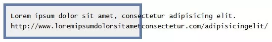
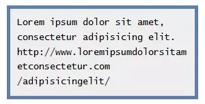

# 常用css代码片段

## 实际工作中，让某一行字不换行，多余字便显示省略号的这种需求还是挺多的

``` css
 //这行文字内容的宽度
 width:xxx;
 //clip：不显示省略标记（...），而是简单的裁切；ellipsis：当对象内文本溢出时显示省略标记（...）
 text-overflow: ellipsis;
 //禁止文字换行
 white-space: nowrap;
 //溢出内容为隐藏
 overflow: hidden;
```

## position(定位) display(框盒) float(浮动)解析(TODO)

> 参考

[CSS布局 ——从displayposition float属性谈起](https://www.cnblogs.com/dolphinX/archive/2012/10/13/2722501.html)
[Flex 布局教程：语法篇](http://www.ruanyifeng.com/blog/2015/07/flex-grammar.html?utm_source=tuicool)
[Flex 布局教程：实例篇](http://www.ruanyifeng.com/blog/2015/07/flex-examples.html)

## 包含块（containing block)

[css规范2.2 10.1节对包含块的定义](https://www.w3.org/TR/CSS22/visudet.html#containing-block-details)
包含块（Containing Block）是视觉格式化模型的一个重要概念，它与框模型类似，也可以理解为一个矩形，而这个矩形的作用是为它里面包含的元素提供一个参考，元素的尺寸和位置的计算往往是由该元素所在的包含块决定的。
包含块简单说就是定位参考框，或者定位坐标参考系，元素一旦定义了定位显示（相对、绝对、固定）都具有包含块性质，它所包含的定位元素都将以该包含块为坐标系进行定位和调整。

用户代理（比如浏览器）选择根元素作为 containing block（称之为初始 containing block）。
对于其它元素，除非元素使用的是绝对位置，containing block 由最近的块级祖先元素盒子的内容边界组成。
如果元素有属性 'position:fixed'，containing block 由视口建立。
如果元素有属性 'position:absolute'，containing block 由最近的 position 不是 static 的祖先建立，按下面的步骤：

    如果 direction 是 ltr（左到右），祖先产生的第一个盒子的上、左内容边界是 containing block 的上方和左方，祖先的最后一个盒子的下、右内容边界是 containing block 的下方和右方。
    如果 direction 是 rtl（右到左），祖先产生的第一个盒子的上、右内容边界是 containing block 的上方和右方，祖先的最后一个盒子的下、左内容边界是 containing block 的下方和左方。
    如果祖先是块级元素，containing block 由祖先的 padding edge 形成。
    如果祖先是内联元素，containing block 取决于祖先的 direction 属性。
    如果没有祖先，根元素盒子的内容边界确定为 containing block。

> 参考

[你不一定知道的css知识——包含块](https://www.jianshu.com/p/ac7771ea1e9e)

## 垂直对齐

如果你用CSS，则你会有困惑：我该怎么垂直对齐容器中的元素？现在，利用CSS3的Transform，可以很优雅的解决这个困惑：

``` css
.verticalcenter {
    position: relative;
    top: 50%;
    -webkit-transform: translateY(-50%);
    -o-transform: translateY(-50%);
    transform: translateY(-50%);
}
```

使用这个技巧，从单行文本、段落到box，都会垂直对齐。目前浏览器对Transform的支持是需要关注的，
Chrome 4, Opera 10, Safari 3, Firefox 3, and Internet Explorer 9均支持该属性。

## 伸展一个元素到窗口高度

在具体场景中，你可能想要将一个元素伸展到窗口高度，基本元素的调整只能调整容器的大小, 因此要使一个元素伸展到窗口高度，
我们需要伸展顶层元素：html和body:

``` css
html,
body {
    height: 100%;
}
```

然后将100%应用到任何元素的高

``` css
div {
    height: 100%;
}
```

## 基于文件格式使用不同的样式

为了更容易知道链接的目标，有时你想让一些链接看起来和其它的不同。下面的片段在文本链接前添加一个图标，对不同的资源使用不同的图标或图片：

``` css
a[href^="http://"] {
    padding-right: 20px;
    background: url(external.gif) no-repeat center right;
}

/* emails */
a[href^="mailto:"] {
    padding-right: 20px;
    background: url(email.png) no-repeat center right;
}

/* pdfs */
a[href$=".pdf"] {
    padding-right: 20px;
    background: url(pdf.png) no-repeat center right;
}
```

## 创建跨浏览器的图像灰度

灰度有时看起来简约和优雅，能为网站呈现更深层次的色调。在示例中，我们将对一个SVG图像添加灰度过滤：

``` html
<svg xmlns="http://www.w3.org/2000/svg">
    <filter id="grayscale">
        <feColorMatrix type="matrix" values="0.3333 0.3333 0.3333 0 0 0.3333 0.3333 0.3333 0 0 0.3333 0.3333 0.3333 0 0 0 0 0 1 0" />
    </filter>
</svg>
```

为了跨浏览器，会用到filter属性：

``` css
img {
    filter: url(filters.svg#grayscale);
    /* Firefox 3.5+ */
    filter: gray;
    /* IE6-9 */
    -webkit-filter: grayscale(1);
    /* Google Chrome, Safari 6+ & Opera 15+ */
}
```

## 背景渐变动画

CSS中最具诱惑的一个功能是能添加动画效果，除了渐变，你可以给背景色、透明度、元素大小添加动画。目前，你不能为渐变添加动画，但下面的代码可能有帮助。它通过改变背景位置，让它看起来有动画效果。

``` css
button {
    background-image: linear-gradient(#5187c4, #1c2f45);
    background-size: auto 200%;
    background-position: 0 100%;
    transition: background-position 0.5s;
}

button:hover {
    background-position: 0 0;
}
```

## CSS：表格列宽自适用

对于表格，当谈到调整列宽时，是比较痛苦的。然后，这里有一个可以使用的技巧：给td元素添加white-space: nowrap; 能让文本正确的换行

``` css
td {
    white-space: nowrap;
}
```

## 只在一边或两边显示盒子阴影

如果你要一个盒阴影，试试这个技巧，能为任一边添加阴影。为了实现这个，首先定义一个有具体宽高的盒子，然后正确定位:after伪类。实现底边阴影的代码如下

``` css
.box-shadow {
    background-color: #FF8020;
    width: 160px;
    height: 90px;
    margin-top: -45px;
    margin-left: -80px;
    position: absolute;
    top: 50%;
    left: 50%;
}

.box-shadow:after {
    content: "";
    width: 150px;
    height: 1px;
    margin-top: 88px;
    margin-left: -75px;
    display: block;
    position: absolute;
    left: 50%;
    z-index: -1;
    -webkit-box-shadow: 0px 0px 8px 2px #000000;
    -moz-box-shadow: 0px 0px 8px 2px #000000;
    box-shadow: 0px 0px 8px 2px #000000;
}
```

## 包裹长文本

如果你碰到一个比自身容器长的文本，这个技巧对你很有用。在这个示例中，默认时，不管容器的宽度，文本都将水平填充。

[](docs/images/646.webp)

简单的CSS代码就能在容器中调整文本：

``` css
pre {
    white-space: pre-line;
    word-wrap: break-word;
}
```

效果看起来如下：
[](docs/images/647.webp)

## 制造模糊文本

想要让文本模糊？可以使用color透明和text-shadow实现

``` css
.blurry-text {
    color: transparent;
    text-shadow: 0 0 5px rgba(0, 0, 0, 0.5);
}
```

## 用CSS动画实现省略号动画

这个片段将帮助你制造一个ellipsis的动画，对于简单的加载状态是很有用的，而不用去使用gif图像。

``` css
.loading:after {
    overflow: hidden;
    display: inline-block;
    vertical-align: bottom;
    animation: ellipsis 2s infinite;
    content: "\2026";
    /* ascii code for the ellipsis character */
}

@keyframes ellipsis {
    from {
        width: 2px;
    }

    to {
        width: 15px;
    }
}
```

## 样式重置

``` css
html,
body,
div,
span,
applet,
object,
iframe,
h1,
h2,
h3,
h4,
h5,
h6,
p,
blockquote,
pre,
a,
abbr,
acronym,
address,
big,
cite,
code,
del,
dfn,
em,
img,
ins,
kbd,
q,
s,
samp,
small,
strike,
strong,
sub,
sup,
tt,
var,
b,
u,
i,
center,
dl,
dt,
dd,
ol,
ul,
li,
fieldset,
form,
label,
legend,
table,
caption,
tbody,
tfoot,
thead,
tr,
th,
td,
article,
aside,
canvas,
details,
embed,
figure,
figcaption,
footer,
header,
hgroup,
menu,
nav,
output,
ruby,
section,
summary,
time,
mark,
audio,
video {
    margin: 0;
    padding: 0;
    border: 0;
    font-size: 100%;
    font: inherit;
    vertical-align: baseline;
    outline: none;
    -webkit-box-sizing: border-box;
    -moz-box-sizing: border-box;
    box-sizing: border-box;
}

html {
    height: 101%;
}

body {
    font-size: 62.5%;
    line-height: 1;
    font-family: Arial, Tahoma, sans-serif;
}

article,
aside,
details,
figcaption,
figure,
footer,
header,
hgroup,
menu,
nav,
section {
    display: block;
}

ol,
ul {
    list-style: none;
}

blockquote,
q {
    quotes: none;
}

blockquote:before,
blockquote:after,
q:before,
q:after {
    content: '';
    content: none;
}

strong {
    font-weight: bold;
}

table {
    border-collapse: collapse;
    border-spacing: 0;
}

img {
    border: 0;
    max-width: 100%;
}

p {
    font-size: 1.2em;
    line-height: 1.0em;
    color: #333;
}
```

## 典型的CSS清除浮动

``` css
.clearfix:after {
    content: ".";
    display: block;
    clear: both;
    visibility: hidden;
    line-height: 0;
    height: 0;
}

.clearfix {
    display: inline-block;
}

html[xmlns] .clearfix {
    display: block;
}

* html .clearfix {

    height: 1%;
}
```

## 新版清除浮动（2011）

``` css
.clearfix:before,
.container:after {
    content: "";
    display: table;
}

.clearfix:after {
    clear: both;
}

/* IE 6/7 */
.clearfix {
    zoom: 1;
}
```

## 跨浏览器的透明

``` css
.transparent {
    filter: alpha(opacity=50);
    /* internet explorer */
    -khtml-opacity: 0.5;
    /* khtml, old safari */
    -moz-opacity: 0.5;
    /* mozilla, netscape */
    opacity: 0.5;
    /* fx, safari, opera */
}
```

## CSS引用模板

``` css
blockquote {
    background: #f9f9f9;
    border-left: 10px solid #ccc;
    margin: 1.5em 10px;
    padding: .5em 10px;
    quotes: "\201C""\201D""\2018""\2019";
}

blockquote:before {
    color: #ccc;
    content: open-quote;
    font-size: 4em;
    line-height: .1em;
    margin-right: .25em;
    vertical-align: -.4em;
}

blockquote p {
    display: inline;
}
```

## 个性圆角

```css 
#container {

    -webkit-border-radius: 4px 3px 6px 10px;
    -moz-border-radius: 4px 3px 6px 10px;
    -o-border-radius: 4px 3px 6px 10px;
    border-radius: 4px 3px 6px 10px;

}
/* alternative syntax broken into each line */#container {

    -webkit-border-top-left-radius: 4px;
    -webkit-border-top-right-radius: 3px;
    -webkit-border-bottom-right-radius: 6px;
    -webkit-border-bottom-left-radius: 10px;
    -moz-border-radius-topleft: 4px;
    -moz-border-radius-topright: 3px;
    -moz-border-radius-bottomright: 6px;
    -moz-border-radius-bottomleft: 10px;

}

``` 

## 通用媒体查询

```css
/* Smartphones (portrait and landscape) ----------- */
@media only screen
and (min-device-width : 320px) and (max-device-width : 480px) {
  /* Styles */
}
/* Smartphones (landscape) ----------- */
@media only screen and (min-width : 321px) {
  /* Styles */
}
/* Smartphones (portrait) ----------- */
@media only screen and (max-width : 320px) {
  /* Styles */
}
/* iPads (portrait and landscape) ----------- */
@media only screen and (min-device-width : 768px) and (max-device-width : 1024px) {
  /* Styles */
}
/* iPads (landscape) ----------- */
@media only screen and (min-device-width : 768px) and (max-device-width : 1024px) and (orientation : landscape) {
  /* Styles */
}
/* iPads (portrait) ----------- */
@media only screen and (min-device-width : 768px) and (max-device-width : 1024px) and (orientation : portrait) {
  /* Styles */
}
/* Desktops and laptops ----------- */
@media only screen and (min-width : 1224px) {
  /* Styles */
}
/* Large screens ----------- */
@media only screen and (min-width : 1824px) {
  /* Styles */
}
/* iPhone 4 ----------- */
@media only screen and (-webkit-min-device-pixel-ratio:1.5), only screen and (min-device-pixel-ratio:1.5) {
  /* Styles */
}
```

## 现代字体栈

``` css
/* Times New Roman-based serif */
font-family: Cambria,
"Hoefler Text",
Utopia,
"Liberation Serif",
"Nimbus Roman No9 L Regular",
Times,
"Times New Roman",
serif;
/* A modern Georgia-based serif */
font-family: Constantia,
"Lucida Bright",
Lucidabright,
"Lucida Serif",
Lucida,
"DejaVu Serif,""Bitstream Vera Serif",
"Liberation Serif",
Georgia,
serif;
/*A more traditional Garamond-based serif */
font-family: "Palatino Linotype",
Palatino,
Palladio,
"URW Palladio L",
"Book Antiqua",
Baskerville,
"Bookman Old Style",
"Bitstream Charter",
"Nimbus Roman No9 L",
Garamond,
"Apple Garamond",
"ITC Garamond Narrow",
"New Century Schoolbook",
"Century Schoolbook",
"Century Schoolbook L",
Georgia,
serif;
/*The Helvetica/Arial-based sans serif */
font-family: Frutiger,
"Frutiger Linotype",
Univers,
Calibri,
"Gill Sans",
"Gill Sans MT",
"Myriad Pro",
Myriad,
"DejaVu Sans Condensed",
"Liberation Sans",
"Nimbus Sans L",
Tahoma,
Geneva,
"Helvetica Neue",
Helvetica,
Arial,
sans-serif;
/*The Verdana-based sans serif */
font-family: Corbel,
"Lucida Grande",
"Lucida Sans Unicode",
"Lucida Sans",
"DejaVu Sans",
"Bitstream Vera Sans",
"Liberation Sans",
Verdana,
"Verdana Ref",
sans-serif;
/*The Trebuchet-based sans serif */
font-family: "Segoe UI",
Candara,
"Bitstream Vera Sans",
"DejaVu Sans",
"Bitstream Vera Sans",
"Trebuchet MS",
Verdana,
"Verdana Ref",
sans-serif;
/*The heavier "Impact" sans serif */
font-family: Impact,
Haettenschweiler,
"Franklin Gothic Bold",
Charcoal,
"Helvetica Inserat",
"Bitstream Vera Sans Bold",
"Arial Black",
sans-serif;
/*The monospace */
font-family: Consolas,
"Andale Mono WT",
"Andale Mono",
"Lucida Console",
"Lucida Sans Typewriter",
"DejaVu Sans Mono",
"Bitstream Vera Sans Mono",
"Liberation Mono",
"Nimbus Mono L",
Monaco,
"Courier New",
Courier,
monospace;
```

## 自定义文本选择

``` css
::selection {
    background: #e2eae2;
}

::-moz-selection {
    background: #e2eae2;
}

::-webkit-selection {
    background: #e2eae2;
}
```

## 为logo隐藏H1

```css
h1 {
    text-indent: -9999px;
    margin: 0 auto;
    width: 320px;
    height: 85px;
    background: transparent url("images/logo.png") no-repeat scroll;
}
```

## 图片边框偏光

```css
img.polaroid {
    background:#000; /*Change this to a background image or remove*/
    border:solid #fff;
    border-width:6px 6px 20px 6px;
    box-shadow:1px 1px 5px #333; /* Standard blur at 5px. Increase for more depth */
    -webkit-box-shadow:1px 1px 5px #333;
    -moz-box-shadow:1px 1px 5px #333;
    height:200px; /*Set to height of your image or desired div*/
    width:200px; /*Set to width of your image or desired div*/
}
```

## 锚链接伪类 

```css
a:link { color: blue; }
a:visited { color: purple; }
a:hover { color: red; }
a:active { color: yellow; }
```

## 奇特的CSS引用

```css
.has-pullquote:before {
    /* Reset metrics. */
    padding: 0;
    border: none;
    /* Content */
    content: attr(data-pullquote);
    /* Pull out to the right, modular scale based margins. */
    float: right;
    width: 320px;
    margin: 12px -140px 24px 36px;
    /* Baseline correction */
    position: relative;
    top: 5px;
    /* Typography (30px line-height equals 25% incremental leading) */
    font-size: 23px;
    line-height: 30px;
}
.pullquote-adelle:before {
    font-family: "adelle-1", "adelle-2";
    font-weight: 100;
    top: 10px !important;
}
.pullquote-helvetica:before {
    font-family: "Helvetica Neue", Arial, sans-serif;
    font-weight: bold;
    top: 7px !important;
}
.pullquote-facit:before {
    font-family: "facitweb-1", "facitweb-2", Helvetica, Arial, sans-serif;
    font-weight: bold;
    top: 7px !important;
}
```

## CSS3：全屏背景

```css
html {
    background: url('images/bg.jpg') no-repeat center center fixed;
    -webkit-background-size: cover;
    -moz-background-size: cover;
    -o-background-size: cover;
    background-size: cover;
}
```

## 内容垂直居中

```css
.container {
    min-height: 6.5em;
    display: table-cell;
    vertical-align: middle;
}
```

## 强制出现垂直滚动条

```css
html { height: 101% }
```

## CSS3渐变模板

```css
#colorbox {
    background: #629721;
    background-image: -webkit-gradient(linear, left top, left bottom, from(#83b842), to(#629721));
    background-image: -webkit-linear-gradient(top, #83b842, #629721);
    background-image: -moz-linear-gradient(top, #83b842, #629721);
    background-image: -ms-linear-gradient(top, #83b842, #629721);
    background-image: -o-linear-gradient(top, #83b842, #629721);
    background-image: linear-gradient(top, #83b842, #629721);}
```

## @font-face模板

```css
@font-face {
    font-family: 'MyWebFont';
    src: url('webfont.eot'); /* IE9 Compat Modes */
    src: url('webfont.eot?#iefix') format('embedded-opentype'), /* IE6-IE8 */
    url('webfont.woff') format('woff'), /* Modern Browsers */
    url('webfont.ttf')  format('truetype'), /* Safari, Android, iOS */
    url('webfont.svg#svgFontName') format('svg'); /* Legacy iOS */
}
body {
    font-family: 'MyWebFont', Arial, sans-serif;
}
```

## 缝合CSS3元素

```css
p {
    position:relative;
    z-index:1;
    padding: 10px;
    margin: 10px;
    font-size: 21px;
    line-height: 1.3em;
    color: #fff;
    background: #ff0030;
    -webkit-box-shadow: 0 0 0 4px #ff0030, 2px 1px 4px 4px rgba(10,10,0,.5);
    -moz-box-shadow: 0 0 0 4px #ff0030, 2px 1px 4px 4px rgba(10,10,0,.5);
    box-shadow: 0 0 0 4px #ff0030, 2px 1px 6px 4px rgba(10,10,0,.5);
    -webkit-border-radius: 3px;
    -moz-border-radius: 3px;
    border-radius: 3px;
}
p:before {
    content: "";
    position: absolute;
    z-index: -1;
    top: 3px;
    bottom: 3px;
    left :3px;
    right: 3px;
    border: 2px dashed #fff;}
p a {
    color: #fff;
    text-decoration:none;
}
p a:hover, p a:focus, p a:active {
    text-decoration:underline;
}
```

## CSS3 斑马线

```css
tbody tr:nth-child(odd) {
    background-color: #ccc;}
```

## 有趣的&

```css
.amp {
    font-family: Baskerville, 'Goudy Old Style', Palatino, 'Book Antiqua', serif;
    font-style: italic;
    font-weight: normal;
}
```

## 在可打印的网页中显示URLs

```css
@media print   {  
  a:after {  
    content: " [" attr(href) "] ";  
  }  
}
```

## 论文页面的卷曲效果

```css
ul.box {
    position: relative;
    z-index: 1; /* prevent shadows falling behind containers with backgrounds */
    overflow: hidden;
    list-style: none;
    margin: 0;
    padding: 0;
}
ul.box li {
    position: relative;
    float: left;
    width: 250px;
    height: 150px;
    padding: 0;
    border: 1px solid #efefef;
    margin: 0 30px 30px 0;
    background: #fff;
    -webkit-box-shadow: 0 1px 4px rgba(0, 0, 0, 0.27), 0 0 40px rgba(0, 0, 0, 0.06) inset;
    -moz-box-shadow: 0 1px 4px rgba(0, 0, 0, 0.27), 0 0 40px rgba(0, 0, 0, 0.06) inset;
    box-shadow: 0 1px 4px rgba(0, 0, 0, 0.27), 0 0 40px rgba(0, 0, 0, 0.06) inset;
}
ul.box li:before,
ul.box li:after {
    content: '';
    z-index: -1;
    position: absolute;
    left: 10px;
    bottom: 10px;
    width: 70%;
    max-width: 300px; /* avoid rotation causing ugly appearance at large container widths */
    max-height: 100px;
    height: 55%;
    -webkit-box-shadow: 0 8px 16px rgba(0, 0, 0, 0.3);
    -moz-box-shadow: 0 8px 16px rgba(0, 0, 0, 0.3);
    box-shadow: 0 8px 16px rgba(0, 0, 0, 0.3);
    -webkit-transform: skew(-15deg) rotate(-6deg);
    -moz-transform: skew(-15deg) rotate(-6deg);
    -ms-transform: skew(-15deg) rotate(-6deg);
    -o-transform: skew(-15deg) rotate(-6deg);
    transform: skew(-15deg) rotate(-6deg);
}
ul.box li:after {
    left: auto;
    right: 10px;
    -webkit-transform: skew(15deg) rotate(6deg);
    -moz-transform: skew(15deg) rotate(6deg);
    -ms-transform: skew(15deg) rotate(6deg);
    -o-transform: skew(15deg) rotate(6deg);
    transform: skew(15deg) rotate(6deg);
}
```


参考： https://segmentfault.com/a/1190000012833458#table
