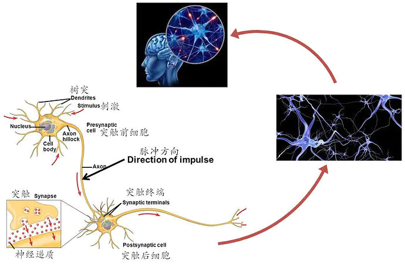

# 深度学习


参考教程 

Bobby0322
https://www.jianshu.com/p/ec41ff0e5943

https://www.zybuluo.com/hanbingtao/note/433855

吴恩达
https://www.coursera.org/learn/machine-learning

台湾李宏毅 ppt
https://www.slideshare.net/tw_dsconf/ss-62245351?qid=108adce3-2c3d-4758-a830-95d0a57e46bc&v=&b=&from_search=3

机器学习简介
你是否曾经听到过人们谈论机器学习，而你却对其含义只有一个模糊的概念呢？你是否已经厌倦了在和同事对话时只能点头呢？现在，让我们一起来改变这个现状吧！

这篇指南是为那些对机器学习感兴趣，但又不知从哪里开始的人而写的。我猜有很多人曾经尝试着阅读机器学习的维基百科词条，但是读着读着倍感挫折，然后直接放弃，希望能有人给出一个更直观的解释。本文就是你们想要的东西。

本文的写作目标是让任何人都能看懂，这意味着文中有大量的概括。但是那又如何呢？只要能让读者对机器学习更感兴趣，这篇文章的任务也就完成了。

什么是机器学习？
机器学习是一种概念：不需要写任何与问题有关的特定代码，泛型算法（Generic Algorithms）[1]就能告诉你一些关于你数据的有趣结论。不用编码，你将数据输入泛型算法当中，它就会在数据的基础上建立出它自己的逻辑。

比如说，有一种算法被称为分类算法，它可以将数据分为不同的组。分类算法可以用来识别手写数字；不用修改一行代码，它也可以用来区分垃圾邮件和非垃圾邮件。如果给同样的算法输入不同的训练数据，它就能得出不同的分类逻辑。


机器学习算法是个黑盒，它可以重复使用于很多不同的分类问题。

「机器学习」是一个涵盖性术语，它覆盖了大量类似的泛型算法。

两类机器学习算法
你可以把机器学习算法分为两大类：监督式学习（supervised Learning）和非监督式学习（unsupervised Learning）。要区分两者很简单，但也非常重要。

监督式学习
假设你是一名房地产经纪人，你的生意蒸蒸日上，因此你雇了一批新员工来帮忙。但是问题来了——虽然你可以一眼估算出房子的价格，但新员工却不像你这样经验丰富，他们不知道如何给房子估价。

为了帮助你的新员工（也许就是为了给自己放个假嘻嘻），你决定写一个可以根据房屋大小、地段以及同类房屋成交价等因素来评估一间房屋的价格的小软件。

近三个月来，每当你的城市里有人卖了房子，你都记录了下面的细节——卧室数量、房屋大小、地段等等。但最重要的是，你写下了最终的成交价：


这就是我们的「训练数据」

使用这些训练数据，我们要来编写一个能够估算该地区其他房屋价值的程序：

我们希望使用这些训练数据来预测其他房屋的价格。
这就是监督式学习。你已经知道了每一栋房屋的售价，换句话说，你已经知道了问题的答案，并且可以反向找出解题的逻辑。
为了编写你的软件，你将包含每一套房产的训练数据输入到你的机器学习算法当中去。算法会尝试找出需要做哪些数学运算来得出价格。
这就好像是你已经知道了数学测试题的答案，但是算式中的运算符号都被擦去了：
天啊！一个阴险的学生擦去了参考答案上的算术符号！
你能从这张图里看出来测验中的数学题是怎样的吗？你知道自己应该对左边的数字「做些什么」，才能得到右边的答案。

在监督式学习中，你让计算机为你算出这种关系。而一旦你知道了解决这类特定问题所需要的数学方法后，你就可以解答其它同类问题了！

非监督式学习
让我们回到房地产经纪人的例子。如果你不知道每栋房子的售价怎么办？即使你所知道的仅仅是每栋房屋的大小、位置等信息，你也可以搞出一些很酷炫的花样来。这就是我们所说的非监督式学习。

即使你并不是在尝试预测未知的数据（如价格），你也可以运用机器学习做一些有意思的事。
这就有点像有人给你一张纸，上面写了一列数字，然后说：「我不太清楚这些数字有什么意义，但也许你能找出些规律或是把它们分类什么的——祝你好运！」

所以该怎么处理这些数据呢？首先，你可以用个算法自动从数据中划分出不同的细分市场。也许你会发现，当地大学附近的购房者特喜欢户型小、卧室多的房子，而郊区的购房者偏好三卧室的大户型。了解这些不同消费者的喜好可以直接帮助你的营销。

你还可以做件很酷炫的事，就是自动找出非同寻常的房屋。这些与众不同的房产也许是奢华的豪宅，而你可以将最优秀的销售人员集中在这些地区，因为他们的佣金更高。

在接下来的内容中我们主要讨论监督式学习，但这并不是因为非监督式学习比较没用或是无趣。实际上，随着算法的改良，非监督式学习正变得越来越重要，因为即使不将数据和正确答案联系在一起，它也可以被使用。

太酷炫了，但是估算房价真能被看作「学习」吗？
作为人类的一员，你的大脑可以应付绝大多数情况，并且在没有任何明确指令时也能够学习如何处理这些情况。如果你做房地产经纪人时间足够长，你对于房产的合适定价、房屋的最佳营销方式以及客户会感兴趣类型等等都会有一种本能般的「感觉」。强人工智能研究的目标就是要计算机复制这种能力。

但是目前的机器学习算法还没有那么强大——它们只能在非常特定的、有限的问题上有效。也许在这种情况下，「学习」更贴切的定义是「在少量样本数据的基础上找出一个公式来解决特定的问题」。

但是「机器在少量样本数据的基础上找出一个公式来解决特定的问题」不是个好名字。所以最后我们用「机器学习」取而代之。

当然了，如果你是在 50 年后的未来读的这篇文章，而我们人类也已经得出了强人工智能的算法的话，那这篇文章看起来就像个老古董了。那样的话，就别读了，去让你的机器佣人给你做份三明治吧，未来的人类。

让我们愉快地写代码吧！

所以，你打算怎么写上面例子中评估房价的程序呢？在往下看之前先思考一下吧。

如果对机器学习一无所知，你很有可能会尝试写出一些基本规则来评估房价，如下：
```python
def estimate_house_sales_price(num_of_bedrooms, sqft, neighborhood):
  price = 0
  #在我这地方，每平方英尺房屋均价是 200 美元
  price_per_sqft = 200
  if neighborhood == "hipsterton":
    #但是有些地段房价会贵一点
    price_per_sqft = 400
  elif neighborhood == "skid row":
    # 有些地段房价便宜点
    price_per_sqft = 100
  # 们先按面积大小估计房屋价格基准
  price = price_per_sqft * sqft
  # 现在根据卧室数量微调价格
  if num_of_bedrooms == 0:
    # 工作室类型的公寓比较便宜
    price = price — 20000
  else:
    # 卧室数量越多，通常房价越贵
    price = price + (num_of_bedrooms * 1000)
 return price
 ```
假如你像这样瞎忙几个小时，最后也许会得到一些像模像样的东西。但是你的程序永不会完美，而且当价格变化时很难维护。

如果能让计算机找出实现上述函数功能的办法，岂不更好？只要返回的房价数字正确，谁会在乎函数具体干了些什么呢？
```python
def estimate_house_sales_price(num_of_bedrooms, sqft, neighborhood):
  price = <computer, plz do some math for me>
  return price
```

考虑这个问题的一种角度是将价格看作一碗美味的汤，而汤的原材料就是卧室数量、面积和地段。如果你能算出每种原材料对最终的价格有多大影响，也许就能得到各种原材料混合形成最终价格的具体比例。

这样可以将你最初的程序（全是令人抓狂的 if else 语句）简化成类似如下的样子：

```python
def estimate_house_sales_price(num_of_bedrooms, sqft, neighborhood):
 price = 0
 # 一小撮这个
 price += num_of_bedrooms * .841231951398213
 # 一大撮那个
 price += sqft * 1231.1231231
 # 或许再加一把这个
 price += neighborhood * 2.3242341421
 # 最后，再多加一点点盐
 price += 201.23432095
 return price
```

注意那些用粗体标注的神奇数字——.841231951398213, 1231.1231231, 2.3242341421, 和201.23432095。它们称为权重（weight）。如果我们能找出对每栋房子都适用的完美权重，我们的函数就能预测所有的房价！[3]

一种找出最佳权重的笨办法如下所示：

第一步：
首先，将每个权重都设为 1.0：

```python
def estimate_house_sales_price(num_of_bedrooms, sqft, neighborhood):
  price = 0
  # 一小撮这个
  price += num_of_bedrooms * 1.0
  # 一大撮那个
  price += sqft * 1.0
  # 或许再加一把这个
  price += neighborhood * 1.0
  # 最后，再多加一点点盐
  price += 1.0
  return price
```
第二步：
将你知道的每栋房产的数据代入函数进行运算，检验估算值与正确价格的偏离程度：


用你的程序来预测每栋房屋的价格
比如说，如果第一套房产实际成交价为 25 万美元，你的函数估价为 17.8 万美元，这一套房产你就差了 7.2 万。

现在，将你的数据集中的每套房产估价偏离值平方后求和。假设你的数据集中交易了 500 套房产，估价偏离值平方求和总计为 86,123,373 美元。这个数字就是你的函数现在的「错误」程度。

现在，将总和除以 500，得到每套房产的估价偏差的平均值。将这个平均误差值称为你函数的代价（cost）。

如果你能通过调整权重，使得这个代价变为 0，你的函数就完美了。它意味着，根据输入的数据，你的程序对每一笔房产交易的估价都是分毫不差。所以这就是我们的目标——通过尝试不同的权重值，使代价尽可能的低。

第三步：
通过尝试所有可能的权重值组合，不断重复第二步。哪一个权重组合的代价最接近于 0，你就使用哪个。当你找到了合适的权重值，你就解决了问题!

兴奋的时刻到了！
挺简单的，对吧？想一想刚才你做了些什么。你拿到了一些数据，将它们输入至三个泛型的、简单的步骤中，最后你得到了一个可以对你所在区域任何房屋进行估价的函数。房价网站们，你们要小心了！

但是下面的一些事实可能会让你更兴奋：

过去 40 年来，很多领域（如语言学、翻译学）的研究表明，这种「搅拌数字汤」（我编的词）的泛型学习算法已经超过了那些真人尝试明确规则的方法。机器学习的「笨」办法终于打败了人类专家。

你最后写出的程序是很笨的，它甚至不知道什么是「面积」和「卧室数量」。它知道的只是搅拌，改变数字来得到正确的答案。

你可能会对「为何一组特殊的权重值会有效」一无所知。你只是写出了一个你实际上并不理解却能证明有效的函数。

试想，如果你的预测函数输入的参数不是「面积」和「卧室数量」，而是一列数字，每个数字代表了你车顶安装的摄像头捕捉的画面中的一个像素。然后，假设预测的输出不是「价格」而是「方向盘转动角度」，这样你就得到了一个程序可以自动操纵你的汽车了！

太疯狂了，对吧？

第三步里「尝试每个数字」是怎么一回事？
好吧，当然你不可能试遍所有权重组合来找到效果最好的组合。直到世界毁灭你也算不完，因为这数字和组合无穷无尽。

为了避免这种情况，数学家们找到了很多种聪明的办法来快速找到优秀的权重值。下面是一种：

首先，写出一个简单的等式表示上面的第二步：

这就是你的代价函数（CostFunction）

现在让我们，使用机器学习数学术语（现在暂时你可以忽略它们），重新改写同样的这一等式：

θ表示当前的权重值。J(θ)表示「当前权重的代价」
这个等式表示，在当前权重值下，我们估价程序的偏离程度。

如果我们为这个等式中所有卧室数和面积的可能权重值作图的话，我们会得到类似下图的图表：

我们代价函数的图形就像一个碗。纵轴表示代价

图中，蓝色的最低点就是代价最低的地方——在这里我们的程序偏离最小。最高点们意味着偏离最大。所以，如果我们能找到一组权重值让我们到达图中的最低点，我们就得到了答案！


因此，我们需要做的只是调整我们的权重，使得我们在图上朝着最低点「走下坡路」。如果我们不断微调权重，一直向最低点移动，那么我们最终不用尝试太多权重就可以到达那里。
如果你还记得一点微积分的话，你也许记得如果你对一个函数求导，它会告诉你函数任意一点切线的斜率。换句话说，对于图上任意给定的一点，求导能告诉我们哪条是下坡路。我们可以利用这个知识不断走向最低点。[5]

所以，如果我们对代价函数关于每一个权重求偏导，那么我们就可以从每一个权重中减去该值。这样可以让我们更加接近山底。一直这样做，最终我们将到达底部，得到权重的最优值。（读不懂？不用担心，继续往下读）。

这种为函数找出最佳权重的方法叫做批量梯度下降（Batch Gradient Descent）。如果你对细节感兴趣，不要害怕，可以看看这个详细说明。

当你使用一个机器学习算法库来解决实际问题时，这些都已经为你准备好了。但清楚背后的原理依然是有用的。

还有什么是本篇文章略过的内容？
上面我描述的三步算法被称为多元线性回归（multivariate linear regression）。你在估算一个能够拟合所有房价数据点的直线表达式。然后，你再根据房子可能在你的直线上出现的位置，利用这个等式来估算你从未见过的房屋的价格。这是一个十分强大的想法，你可以用它来解决「实际」问题。

但是，尽管我展示给你的这种方法可能在简单的情况下有效，它却不能应用于所有情况。原因之一，就是因为房价不会是简简单单一条连续的直线。

不过幸运的是，有很多办法来处理这种情况。有许多机器学习算法可以处理非线性数据（如神经网络或带核函数的支持向量机）。除此之外，灵活使用线性回归也能拟合更复杂的线条。在所有的情况下，寻找最优权重这一基本思路依然适用。

另外，我忽略了过拟合（overfitting）的概念。得到一组能完美预测原始数据集中房价的权重组很简单，但用这组权重组来预测原始数据集之外的任何新房屋其实都不怎么准确。这也是有许多解决办法的（如正则化以及使用交叉验证的数据集）。学习如何应对这一问题，是学习如何成功应用机器学习技术的重点之一。

换言之，尽管基本概念非常简单，要通过机器学习得到有用的结果还是需要一些技巧和经验的。但是，这是每个开发者都能学会的技巧。

机器学习是黑魔法吗？
一旦你开始明白，用机器学习技术解决那些看似困难问题（如字迹识别）有多便利时，你就会有一种，只要有足够的数据，你就能够用机器学习解决任何问题的感觉。只需要输入数据，计算机就能神奇地找出拟合数据的等式！

但是有一点很重要，你要记住，只有在你拥有的数据对于解决实际问题有效的时候，机器学习才能适用。

例如，如果你建立了一个根据每套房屋内盆栽种类的数量来预测房价的模型，那它永远都不会有效果。因为盆栽种类的数量和房价之间没有任何的关系。所以，无论你多卖力地尝试，计算机永远也推导不出两者之间的关系。

你只能模拟实际存在的关系
所以请记住，如果一个问题人类专家不能手动用数据解决，计算机可能也不能解决。然而，对于那些人类能够解决的问题，如果计算机能够更快地解决，那岂不美哉？

怎样学到更多机器学习的知识
我认为，目前机器学习的最大问题是它主要活跃于学术界和商业研究组织中。对于只想大体了解一下，而不打算成为专家的人们来说，简单易懂的资料不多。但是这种情况每天正在改善。

吴恩达教授（Andrew Ng）在 Coursera 上的免费机器学习课程非常棒。我强烈建议从此入手。对于任何拥有计算机或科学学位的人，或是还能记住一点点数学的人来说，都应该非常容易入门。

另外，你还可以通过下载安装 SciKit-Learn，用它来试验无数个机器学习算法。它是一个 Python 框架，包含了所有常见机器学习算法的「黑盒」版本。


深度学习入门极简教程（一）

摘要： 当你和女朋友在路边手拉手一起约会的时候，你可曾想，你们之间早已碰撞出了一种神秘的智慧–深度学习。恋爱容易，相处不易，不断磨合，打造你们的默契，最终才能决定你们是否在一起。深度学习也一样，输入各种不同的参数，进行训练拟合，最后输出拟合结果。 恋爱又不易，且学且珍惜！

导言： 目前人工智能非常火爆，而深度学习则是引领这一火爆现场的“火箭”。于是，有关“深度学习”的论文、书籍和网络博客汗牛充栋，但大多数这类文章都具备“高不成低不就”的特征。对于高手来说，自然是没有问题，他们本身已经具备非常“深度”的学习能力，如果他们想学习有关深度学习的技术，直接找来最新的研究论文阅读就好了。但是，对于低手（初学者）而言，就没有那么容易了，因为他们基础相对薄弱，通常看不太懂。
于是，我们推出深度学习的入门系列。在这个系列文章中，我们力图用最为通俗易懂、图文并茂的方式，带你入门深度学习。我们都知道，高手从来都是自学出来的。所以，这个深度学习的入门系列，能带给你的是“从入门到精通”，还是“从入门到放弃”，一切都取决你个人的认知。成就你自己的，永远都是你自己，是吧？
好了，言归正传，下面开始我们的正题。

1. 什么是学习？
说到深度学习，我们首先需要知道，什么是学习。
著名学者赫伯特·西蒙教授（Herbert Simon，1975年图灵奖获得者、1978年诺贝尔经济学奖获得者）曾对“学习”给了一个定义：“如果一个系统，能够通过执行某个过程，就此改进了它的性能，那么这个过程就是学习”。
大牛就是大牛，永远都是那么言简意赅，一针见血。从西蒙教授的观点可以看出，学习的核心目的，就是改善性能。
其实对于人而言，这个定义也是适用的。比如，我们现在正在学习“深度学习”的知识，其本质目的就是为了“提升”自己在机器学习上的认知水平。如果我们仅仅是低层次的重复性学习，而没有达到认知升级的目的，那么即使表面看起来非常勤奋，其实我们也仅仅是个“伪学习者”, 因为我们没有改善性能。

2. 什么是机器学习？
遵循西蒙教授的观点，对于计算机系统而言，通过运用数据及某种特定的方法（比如统计的方法或推理的方法），来提升机器系统的性能，就是机器学习。
英雄所见略同。卡内基梅隆大学的Tom Mitchell教授，在他的名作《机器学习》一书中，也给出了更为具体（其实也很抽象）的定义：

对于某类任务（Task，简称T）和某项性能评价准则（Performance，简称P），如果一个计算机程序在T上，以P作为性能的度量，随着很多经验（Experience，简称E）不断自我完善，那么我们称这个计算机程序在从经验E中学习了。

比如说，对于学习围棋的程序AlphaGo，它可以通过和自己下棋获取经验，那么它的任务T就是“参与围棋对弈”；它的性能P就是用“赢得比赛的百分比”来度量。“类似地，学生的任务T就是“上课看书写作业”；它的性能P就是用“期末成绩”来度量”
因此，Mitchell教授认为，对于一个学习问题，我们需要明确三个特征：任务的类型，衡量任务性能提升的标准以及获取经验的来源。

3. 学习的4个象限
在前面的文章中，我们已提到，一般说来，人类的知识在两个维度上可分成四类。即从可统计与否上来看，可分为：是可统计的和不可统计的。从能否推理上看，可分为可推理的和不可推理的。

在横向方向上，对于可推理的，我们都可以通过机器学习的方法，最终可以完成这个推理。传统的机器学习方法，就是试图找到可举一反三的方法，向可推理但不可统计的象限进发（象限Ⅱ）。目前看来，这个象限的研究工作（即基于推理的机器学习）陷入了不温不火的境地，能不能峰回路转，还有待时间的检验。
而在纵向上，对于可统计的、但不可推理的（即象限Ⅲ），可通过神经网络这种特定的机器学习方法，以期望达到性能提升的目的。目前，基于深度学习的棋类博弈（阿尔法狗）、计算机视觉（猫狗识别）、自动驾驶等等，其实都是在这个象限做出了了不起的成就。
从图可知，深度学习属于统计学习的范畴。用李航博士的话来说，统计机器学习的对象，其实就是数据。这是因为，对于计算机系统而言，所有的“经验”都是以数据的形式存在的。作为学习的对象，数据的类型是多样的，可以是各种数字、文字、图像、音频、视频，也可以是它们的各种组合。
统计机器学习，就是从数据出发，提取数据的特征（由谁来提取，是个大是大非问题，下面将给予介绍），抽象出数据的模型，发现数据中的知识，最后又回到数据的分析与预测当中去。

4. 机器学习的方法论
这里稍早说明的一点的是，在深度学习中，经常有“end-to-end（端到端）”学习的提法，与之相对应的传统机器学习是“Divide and Conquer（分而治之）”。这些都是什么意思呢？
“end-to-end”（端到端）说的是，输入的是原始数据（始端），然后输出的直接就是最终目标（末端），中间过程不可知，因此也难以知。比如说，基于深度学习的图像识别系统，输入端是图片的像素数据，而输出端直接就是或猫或狗的判定。这个端到端就是：像素-->判定。
再比如说，“end-to-end”的自动驾驶系统，输入的是前置摄像头的视频信号（其实也就是像素），而输出的直接就是控制车辆行驶指令（方向盘的旋转角度）。这个端到端就是：像素-->指令。
就此，有人批评深度学习就是一个黑箱（Black Box）系统，其性能很好，却不知道为何而好，也就是说，缺乏解释性。其实，这是由于深度学习所处的知识象限决定的。从图1可以看出，深度学习，在本质上，属于可统计不可推理的范畴。“可统计”是很容易理解的，就是说，对于同类数据，它具有一定的统计规律，这是一切统计学习的基本假设。那“不可推理”又是什么概念？其实就是“剪不断、理还乱”的非线性状态了。


在哲学上讲，这种非线性状态，是具备了整体性的“复杂系统”，属于复杂性科学范畴。复杂性科学认为，构成复杂系统的各个要素，自成体系，但阡陌纵横，其内部结构难以分割。简单来说，对于复杂系统，1+1≠2，也就是说，一个简单系统，加上另外一个简单系统，其效果绝不是两个系统的简单累加效应，而可能是大于部分之和。因此，我们必须从整体上认识这样的复杂系统。于是，在认知上，就有了从一个系统或状态（end）直接整体变迁到另外一个系统或状态（end）的形态。这就是深度学习背后的方法论。
与之对应的是“Divide and Conquer（分而治之）”，其理念正好相反，在哲学它属于“还原主义（reductionism，或称还原论）”。在这种方法论中，有一种“追本溯源”的蕴意包含其内，即一个系统（或理论）无论多复杂，都可以分解、分解、再分解，直到能够还原到逻辑原点。
在意象上，还原主义就是“1+1=2”，也就是说，一个复杂的系统，都可以由简单的系统简单叠加而成（可以理解为线性系统），如果各个简单系统的问题解决了，那么整体的问题也就得以解决。比如说，很多的经典力学问题，不论形式有多复杂，通过不断的分解和还原，最后都可以通过牛顿的三大定律得以解决。
经典机器学习（位于第Ⅱ象限），在哲学上，在某种程度上，就可归属于还原主义。传统的机器学习方式，通常是用人类的先验知识，把原始数据预处理成各种特征（feature），然后对特征进行分类。
然而，这种分类的效果，高度取决于特征选取的好坏。传统的机器学习专家们，把大部分时间都花在如何寻找更加合适的特征上。因此，早期的机器学习专家们非常苦逼，故此，传统的机器学习，其实可以有个更合适的称呼——特征工程（feature engineering）。
但这种苦逼，也是有好处的。这是因为，这些特征是由人找出来的，自然也就为人所能理解，性能好坏，机器学习专家们可以“冷暖自知”，灵活调整。

5. 什么是深度学习
再后来，机器学习的专家们发现，可以让神经网络自己学习如何抓取数据的特征，这种学习的方式，效果更佳。于是兴起了特征表示学习（feature representation learning）的风潮。这种学习方式，对数据的拟合也更加的灵活好用。于是，人们终于从自寻“特征”的苦逼生活中解脱出来。
但这种解脱也付出了代价，那就是机器自己学习出来的特征，它们存在于机器空间，完全超越了人类理解的范畴，对人而言，这就是一个黑盒世界。为了让神经网络的学习性能，表现得更好一些，人们只能依据经验，不断地尝试性地进行大量重复的网络参数调整，同样是“苦不堪言”。于是，“人工智能”领域就有这样的调侃：“有多少人工，就有多少智能”。
因此，你可以看到，在这个世界上，存在着一个“麻烦守恒定律”：麻烦不会减少，只会转移。
再后来，网络进一步加深，出现了多层次的“表示学习”，它把学习的性能提升到另一个高度。这种学习的层次多了，其实也就是套路“深了”。于是，人们就给它取了个特别的名称——Deep Learning（深度学习）。
深度学习的学习对象同样是数据。与传统机器学习所不同的是，它需要大量的数据，也就是“大数据（Big Data）”。
有一个观点，在工业界一度很流行，那就是在大数据条件下，简单的学习模型会比复杂模型更加有效。而简单的模型，最后会趋向于无模型，也就是无理论。例如，早在2008年，美国 《连线》（Wired）杂志主编克里斯﹒安德森（Chris Anderson）就曾发出“理论的终结（The End of Theory）”的惊人断言：“海量数据已经让科学方法成为过去时（The Data Deluge Makes the Scientific Method Obsolete）”。
但地平线机器人创始人（前百度深度学习研究院副院长）余凯先生认为，深度学习的惊人进展，是时候促使我们要重新思考这个观点了。也就是说，他认为“大数据+复杂模型”或许能更好地提升学习系统的性能。

6. “恋爱”中的深度学习
法国科技哲学家伯纳德﹒斯蒂格勒（Bernard Stiegler）认为，人们以自己的技术和各种物化的工具，作为自己“额外”的器官，不断的成就自己。按照这个观点，其实，在很多场景下，计算机都是人类思维的一种物化形式。换句话说，计算机的思维（比如说各种电子算法），都能找到人类生活实践的影子。
比如说，现在火热的深度学习，与人们的恋爱过程也有相通之处。在知乎上，就有人（jacky yang）以恋爱为例来说明深度学习的思想，倒也非常传神。我们知道，男女恋爱大致可分为三个阶段：
第一阶段初恋期，相当于深度学习的输入层。妹子吸引你，肯定是有很多因素，比如说脸蛋、身高、身材、性格、学历等等，这些都是输入层的参数。对不同喜好的人，他们对输出结果的期望是不同的，自然他们对这些参数设置的权重也是不一样的。比如，有些人是奔着结婚去的，那么他们对妹子的性格可能给予更高的权重。否则，脸蛋的权重可能会更高。

第二阶段热恋期，对应于深度学习的隐藏层。在这个期间，恋爱双方都要经历各种历练和磨合。清朝湖南湘潭人张灿写了一首七绝：
书画琴棋诗酒花，当年件件不离他。
而今七事都更变，柴米油盐酱醋茶。

这首诗说的就是，在过日子的洗礼中，各种生活琐事的变迁。恋爱是过日子的一部分，其实也是如此，也需要双方不断磨合。这种磨合中的权重取舍平衡，就相等于深度学习中隐藏层的参数调整，它们需要不断地训练和修正！恋爱双方相处，磨合是非常重要的。要怎么磨合呢？光说“520（我爱你）”，是廉价的。这就给我们程序猿（媛）提个醒，爱她（他），就要多陪陪她（他）。陪陪她（他），就增加了参数调整的机会。参数调整得好，输出的结果才能是你想要的。
第三阶段稳定期，自然相当于深度学习的输出层。输出结果是否合适，是否达到预期，高度取决于“隐藏层”的参数 “磨合”得怎么样。

7. 小结
在本小节，我们回顾了“机器学习”的核心要素，那就是通过对数据运用，依据统计或推理的方法，让计算机系统的性能得到提升。而深度学习，则是把由人工选取对象特征，变更为通过神经网络自己选取特征，为了提升学习的性能，神经网络的表示学习的层次较多（较深）。
以上仅仅给出机器学习和深度学习的概念性描述，在下一个小结中，我们将给出机器学习的形式化表示，传统机器学习和深度学习的不同之处在哪里，以及到底什么是神经网络等。

8. 请你思考
在大数据时代，你是赞同科技编辑出生的克里斯﹒安德森的观点呢（仅需简单模型甚至无模型），还是更认可工业界大神余凯先生的观点呢（还是需要复杂模型）？为什么？
你认为用“恋爱”的例子比拟“深度学习”贴切吗？为什么？
为什么非要用“深度”学习，“浅度”不行吗？


深度学习入门极简教程（二）

摘要: 现在的人工智能，大致就是用“硅基大脑”模拟或重现“碳基大脑的过程”。那么，在未来会不会出现“碳硅合一”的大脑或者全面超越人脑的“硅基大脑”呢？专家们的回答是“会的”。而由深度学习引领的人工智能，正在开启这样的时代。

在前面的小节中，我们仅仅泛泛而谈了机器学习、深度学习等概念，在这一小节，我们将给出它的更加准确的形式化描述。
我们经常听到人工智能如何如何？深度学习怎样怎样？那么它们之间有什么关系呢？在本小节，我们首先从宏观上谈谈人工智能的“江湖定位”和深度学习的归属。然后再在微观上聊聊机器学习的数学本质是什么？以及我们为什么要用神经网络？

1. 人工智能的“江湖定位”
宏观上来看， 人类科学和技术的发展，大致都遵循着这样的规律：现象观察、理论提取和人工模拟（或重现）。 人类“观察大脑”的历史由来已久，但由于对大脑缺乏“深入认识”，常常“绞尽脑汁”，也难以“重现大脑”。
直到上个世纪40年代以后，脑科学、神经科学、心理学及计算机科学等众多学科，取得了一系列重要进展，使得人们对大脑的认识相对“深入”，从而为科研人员从“观察大脑”到“重现大脑”搭起了桥梁，哪怕这个桥梁到现在还仅仅是个并不坚固的浮桥。

而所谓的“重现大脑”，在某种程度上，就是目前的研究热点——人工智能。简单来讲，人工智能就是为机器赋予人类的智能。由于目前的机器核心部件是由晶体硅构成，所以可称之为“硅基大脑”。而人类的大脑主要由碳水化合物构成，因此可称之为“碳基大脑”。
那么， 现在的人工智能，通俗来讲，大致就是用“硅基大脑”模拟或重现“碳基大脑”。 那么，在未来会不会出现“碳硅合一”的大脑或者全面超越人脑的“硅基大脑”呢？
有人就认为，在很大程度上，这个答案可能是“会的”！比如说，未来预言大师雷·库兹韦尔（Ray Kurzweil）就预测，到2045年，人类的“奇点”时刻就会临近。这里的“奇点”是指，人类与其他物种（物体）的相互融合，更确切来说，是硅基智能与碳基智能兼容的那个奇妙时刻。
2. 深度学习的归属
在当下，虽然深度学习领跑人工智能。但事实上，人工智能研究领域很广，包括机器学习、计算机视觉、专家系统、规划与推理、语音识别、自然语音处理和机器人等。而机器学习又包括深度学习、监督学习、无监督学习等。简单来讲，机器学习是实现人工智能的一种方法，而深度学习仅仅是实现机器学习的一种技术而已。

需要说明的是，对人工智能做任何形式的划分，都可能是有缺陷的。在图中，人工智能的各类技术分支，彼此泾渭分明，但实际上，它们之间却可能阡陌纵横，比如说深度学习是无监督的。语音识别可以用深度学习的方法来完成。再比如说，图像识别、机器视觉更是当前深度学习的拿手好戏。
一言蔽之， 人工智能的分支并不是一个有序的树，而是一个彼此缠绕的灌木丛。 有时候，一个分藤蔓比另一个分藤蔓生长得快，并且处于显要地位，那么它就是当时的研究热点。深度学习的前生——神经网络的发展，就是这样的几起几落。当下，深度学习如日中天，但会不会也有“虎落平阳被犬欺”的一天呢？从事物的发展规律来看，这一天肯定会到来！
在上图中，既然我们把深度学习和传统的监督学习和无监督学习单列出来，自然是有一定道理的。这就是因为，深度学习是高度数据依赖型的算法，它的性能通常随着数据量的增加而不断增强，也就是说它的可扩展性（Scalability）显著优于传统的机器学习算法。

但如果训练数据比较少，深度学习的性能并不见得就比传统机器学习好。其潜在的原因在于，作为复杂系统代表的深度学习算法，只有数据量足够多，才能通过训练，在深度神经网络中，“恰如其分”地将把蕴含于数据之中的复杂模式表征出来。
不论机器学习，还是它的特例深度学习，在大致上，都存在两个层面的分析：


面向过去（对收集到的历史数据，用作训练），发现潜藏在数据之下的模式，我们称之为描述性分析（Descriptive Analysis）；
面向未来，基于已经构建的模型，对于新输入数据对象实施预测，我们称之为预测性分析（Predictive Analysis）。
前者主要使用了“归纳”，而后者更侧重于“演绎”。对历史对象的归纳，可以让人们获得新洞察、新知识，而对新对象实施演绎和预测，可以使机器更加智能，或者说让机器的某些性能得以提高。二者相辅相成，均不可或缺。
在前面的部分，我们给予机器学习的概念性描述，下面我们给出机器学习的形式化定义。

3. 机器学习的形式化定义
在《未来简史》一书中，尤瓦尔•赫拉利说，根据数据主义的观点，人工智能实际上就是找到一种高效的“电子算法”，用以代替或在某项指标上超越人类的“生物算法”。那么，任何一个“电子算法”都要实现一定的功能（Function），才有意义。
在计算机术语中，中文将“Function”翻译成“函数”，这个多少有点扯淡，因为它的翻译并没有达到“信达雅”的标准，除了给我们留下一个抽象的概念之外，什么也没有剩下来。但这一称呼已被广为接受，我们也只能“约定俗成”地把“功能”叫做“函数”了。
根据台湾大学李宏毅博士的说法，所谓机器学习，在形式上，可近似等同于在数据对象中，通过统计或推理的方法，寻找一个适用特定输入和预期输出功能函数。习惯上，我们把输入变量写作大写的X ，而把输出变量写作大写的Y 。那么所谓的机器学习，在形式上，就是完成如下变换：Y= f(X)

针对下棋博弈功能，如果输入的是一个围棋的棋谱局势（比如AlphaGO）X，那么Y能输出这个围棋的下一步“最佳”走法。

类似地，对于具备智能交互功能的系统（比如微软的小冰），当我们给这个函数X输入诸如“How are you？”，那么Y就能输出诸如“I am fine，thank you？”等智能的回应。

每个具体的输入，都是一个实例（instance），它通常由特征空间（feature vector）构成。在这里，所有特征向量存在的空间称为特征空间（feature space），特征空间的每一个维度，对应于实例的一个特征。

但问题来了，这样“好用的”函数并不那么好找。当输入一个猫的图像后，这个函数并不一定就能输出它就是一只猫，可能它会错误地输出为一条狗或一条蛇。

这样一来，我们就需要构建一个评估体系，来辨别函数的好坏（Goodness）。当然，这中间自然需要训练数据（training data）来“培养”函数的好品质。在第一小节中，我们提到，学习的核心就是性能改善，在下图中，通过训练数据，我们把f1改善为f2的样子，性能（判定的准确度）得以改善了，这就是学习！很自然，这个学习过程如果是在机器上完成的，那就是“机器学习”了。


具体说来，机器学习要想做得好，需要走好三大步：

如何找一系列函数来实现预期的功能，这是建模问题。
如何找出一组合理的评价标准，来评估函数的好坏，这是评价问题。
如何快速找到性能最佳的函数，这是优化问题（比如说，机器学习中梯度下降法干的就是这个活）。
4. 为什么要用神经网络？
我们知道，深度学习的概念源于人工神经网络的研究。含多隐层的多层感知机就是一种深度学习结构。所以说到深度学习，就不能不提神经网络。
那么什么是神经网络呢？有关神经网络的定义有很多。这里我们给出芬兰计算机科学家Teuvo Kohonen的定义（这老爷子以提出“自组织神经网络”而名扬人工智能领域）：“神经网络，是一种由具有自适应性的简单单元构成的广泛并行互联的网络，它的组织结构能够模拟生物神经系统对真实世界所作出的交互反应。”

在机器学习中，我们常常提到“神经网络”，实际上是指“神经网络学习”。学习是大事，不可忘记！
那为什么我们要用神经网络学习呢？这个原因说起来，有点“情非得已”。
我们知道，在人工智能领域，有两大主流门派。第一个门派是符号主义。符号主义的理念是，知识是信息的一种表达形式，人工智能的核心任务，就是处理好知识表示、知识推理和知识运用。这个门派核心方法论是，自顶向下设计规则，然后通过各种推理，逐步解决问题。很多人工智能的先驱（比如CMU的赫伯特•西蒙）和逻辑学家，很喜欢这种方法。但这个门派的发展，目前看来并不太好。未来会不会“峰回路转”，现在还不好说。

还有一个门派，就是试图编写一个通用模型，然后通过数据训练，不断改善模型中的参数，直到输出的结果符合预期，这个门派就是连接主义。连接主义认为，人的思维就是某些神经元的组合。因此，可以在网络层次上模拟人的认知功能，用人脑的并行处理模式，来表征认知过程。这种受神经科学的启发的网络，被称之人工神经网络（Artificial Neural Network，简称ANN）。目前，这个网络的升级版，就是目前非常流行的深度学习。

前面我们提到，机器学习在本质就是寻找一个好用的函数。而人工神经网络最“牛逼”的地方在于，它可以在理论上证明：只需一个包含足够多神经元的隐藏层，多层前馈网络能以任意精度逼近任意复杂度的连续函数。这个定理也被称之为通用近似定理（Universal Approximation Theorem）。这里的“Universal”，也有人将其翻译成“万能的”，由此可见，这个定理的能量有多大。换句话说，神经网络可在理论上解决任何问题，这就是目前深度学习能够“牛逼哄哄”最底层的逻辑（当然，大数据+大计算也功不可没，后面还会继续讨论）。

5. 小结
在本小节中，我们首先谈了谈人工智能的“江湖定位”，然后指出深度学习仅仅是人工智能研究的很小的一个分支，接着我们给出了机器学习的形式化定义。最后我们回答了为什么人工神经网络能“风起云涌”，简单来说，在理论上可以证明，它能以任意精度逼近任意形式的连续函数，而机器学习的本质，不就是要找到一个好用的函数嘛？

在下小节，我们将深度解读什么是激活函数，什么是卷积？（很多教科书真是越讲越糊涂，希望你看到下一小节，能有所收获）

6. 请你思考
学完前面的知识，请你思考如下问题（掌握思辨能力，好像比知识本身更重要）：

你认可库兹韦尔“到2045年人类的奇点时刻就会临近”的观点吗？为什么？库兹韦尔的预测，属于科学的范畴吗？（提示：可以从波普尔的科学评判的标准——是否具备可证伪性分来析。）
深度学习的性能，高度依赖性于训练数据量的大小？这个特性是好还是坏？（提示：在《圣经》中有七宗原罪，其中一宗罪就是暴食，而原罪就是“deadly sin”，即死罪。目前，深度学习贪吃数据和能量，能得以改善吗？）


深度学习入门极简教程（三）

> 摘要： “那些在个人设备里，谦谦卑卑地为我们哼着歌曲的数字仆人，总有一天会成为我们的霸主！”在“忍无可忍，无需再忍”这句俗语背后，也隐藏中神经网络常用的“激活函数”和“卷积”的概念。知其道,用其妙,THIS IS HOW！

在前面的小节中，我们大致了解了机器学习的形式化定义和神经网络的概念，在本小节中，我们将相对深入地探讨一下神经网络中的神经元模型以及深度学习常常用到的激活函数及卷积函数。

1. M-P神经元模型是什么？
在前一小节中，我们已介绍了人工神经网络（Artificial Neural Networks，ANNs）的定义。简单来说，它是一种模仿动物神经网络行为特征，进行分布式并行信息处理的算法数学模型。

神经网络依靠系统的复杂程度，通过调整内部大量“简单单元”之间相互连接的关系，从而达到处理信息的目的，并具有自学习和自适应的能力。

在上述定义中提及到的“简单单元”，其实就是神经网络中的最基本元素——神经元（neuron）模型。在生物神经网络中，每个神经元与其它神经元，通过突触联接。神经元之间的“信息”传递，属于化学物质传递的。当它“兴奋（fire）”时，就会向与它相连的神经元发送化学物质（神经递质, neurotransmiter），从而改变这些神经元的电位；如果某些神经元的电位超过了一个“阈值（threshold）”，那么，它就会被“激活（activation）”，也就是“兴奋”起来，接着向其它神经元发送化学物质，犹如涟漪，就这样一层接着一层传播，如图所示。

[](docs/deeplearn/1845730-1b88e80a2bba4610.webp)

在人工智能领域，有个好玩的派别叫“飞鸟派”。说的就是，如果我们想要学飞翔，就得向“飞鸟”来学习。简单来说，“飞鸟派”就是“仿生派”，即把进化了几百万年的生物，作为“模仿”对象，搞清楚原理后，再复现这些对象的特征。
其实现在所讲的神经网络包括深度学习，都在某种程度上，属于“飞鸟派”——它们在模拟大脑神经元的工作机理，它就是上世纪40年代提出但一直沿用至今的“M-P神经元模型”。
在这个模型中，神经元接收来自n个其它神经元传递过来的输入信号，这些信号的表达，通常通过神经元之间连接的权重（weight）大小来表示，神经元将接收到的输入值按照某种权重叠加起来，并将当前神经元的阈值进行比较，然后通过“激活函数（activation function）”向外表达输出（这在概念上就叫感知机），如图所示。

简单吧？简单！
可这么简单的道理，你咋能就这么轻易知道咧？
事实上，我们知道，对未知世界（比如说人类大脑）的每一点新认识，其实都是因为有大牛曾经艰辛地为我们站过台。前面提到的“M-P神经元模型”，亦是如此。
2. M-P神经元模型”背后的那些人和事情
“M-P神经元模型”，最早源于发表于1943年的一篇开创性论文。论文的两位作者分别是神经生理学家沃伦·麦克洛克（McCulloch）和数学家沃尔特·皮茨（Pitts），论文描述了神经元的时间总和、域值等特征。首次实现用一个简单电路（即感知机），来模拟大脑神经元的行为。

“M-P神经元模型”提出者虽然有两人，但后者皮茨更有声望和传奇色彩。皮茨等人的研究，甚至影响了控制论的诞生和冯·诺伊曼（von Neumann）计算机的设计。

一般来说，每个“牛逼”人的背后，都隐藏着一段“苦逼”的岁月。皮茨同样如此，不过更显“苦涩”而已。1923年3月，沃尔特•皮茨出生于美国密歇根州底特律（Detroit）。小时候，皮茨家境贫寒。但贫穷并没有冷却皮茨那颗爱读书的心。皮茨很早就对数学和哲学表现出浓厚的兴趣，12岁时就开始阅读伯特兰·罗素（Russell）和怀特海（Whitehead）合著的《数学原理》。

年少的皮茨，视罗素为人生偶像，经常就不明觉厉的问题和罗素通信。在书信往来中，罗素发现这个皮茨，人小才不小，于是便邀请他到英国，跟随自己学习逻辑学。

但皮茨家境贫困，连他读高中都供不起，哪还有钱资助他远赴英伦求学。就在皮茨15岁时，皮茨的老爹还强迫他退学，以便在底特律找份工作谋生，补贴家用。

但酷爱学习的皮茨，自然不愿答应，与老爹一言不合，就离家出走，浪荡江湖。从此，他再也没有见过他的家人。

但正可谓“山不转水转，水不转人转”。当皮茨无钱从美抵英国求学。但罗素这位学术大家，却有条件从英国抵达美国任教。

在打听到自己偶像罗素要到芝加哥大学任教（访问教授），皮茨兴奋异常，便只身来到芝加哥拜见。精诚所至，金石为开，终于皮茨见到了罗素。罗素一见皮茨，发现他果然骨骼清奇，天赋异禀。于是，罗素就将皮茨留下来，旁听自己的课程。

话说当时在芝加哥大学任教的，还有一个知名的哲学教授，叫鲁道夫·卡尔纳普（Rudolf Carnap）。他是逻辑实证主义的代表性人物，其哲学思想深受罗素影响，和罗素是好基友。

罗素的课，皮茨自然可以去随便蹭，但活下去，却是皮茨自己的事。在机缘巧合下，卡尔纳普认识了皮茨，并发现皮茨有惊为天人的才华。

卡尔纳普惜才如命，便心生怜悯，利用自己的人际关系，帮皮茨在芝加哥大学谋了打扫卫生的差事。就这样，皮茨这位当代的“扫地僧”，总算是在这所著名大学安顿下来。

再后来，18岁的皮茨在芝加哥的结识了神经学家、哲学家沃伦·麦克洛克（Warren McCulloch）。正是这位麦克洛克，彻底改变了皮茨的人生轨迹。


他们合作的最重要的成就之一，就是那篇“神作”——神经网络的天下第一文：《神经活动中思想内在性的逻辑演算》（A Logical Calculus of Ideas Immanent in Nervous Activity），这篇文章发表在《数学生物物理期刊》上，它也成为控制论的思想源泉之一。

信号在大脑中到底是怎样的一种传输，确切来说，依然一个谜。麦克洛克和皮茨提出的的“M-P神经元模型”，是对生物大脑的过度简化，但却成功地给我们提供了基本原理的证明。但对我我们而言，重要的是可以把它视为与计算机一样的存在，利用一系列的0和1来进行操作。也就是说，大脑的神经细胞也只有两种状态：兴奋（fire）和不兴奋（即抑制）。

这样一来，神经元的工作形式，类似于数字电路中的逻辑门，它接受多个输入，然后产生单一的输出。通过改变神经元的激发阙值，就可完成“与（AND）”、“或（OR）”及“非（NOT）”等三个状态转换功能，如图所示。


这里需要说明的是，“感知机”作为一个专业术语，是皮茨等人发表论文15年之后，在 1958 年, 由康内尔大学心理学教授( Frank Rosenblatt) 提出来的，这是一个两层的人工神经网络，成为后来许多神经网络的基础，但它的理论基础依然还是皮茨等人提出来的“M-P”神经元模型。

不知道读者朋友发现了没有？皮茨（Pitts）等人提出的M-P模型，居然不能实现常用的“异或（XOR）”功能，这也成为人工智能泰斗马文·明斯基 （Marvin Lee Minsky）评判“神经网络”的重要“罪证”之一。

1969年，马文·明斯基和西摩尔· 派普特（Seymour Papert）在出版了《感知机：计算几何简介”》一书[2], 书中论述了感知机模型存在的两个关键问题：

1.单层的神经网络无法解决不可线性分割的问题，典型例子如异或门电路（XOR Circuit）；
2.更为严重的问题是，即使是当时最先进的计算机完也没有足够计算能力，完成神经网络模型所需要的超大的计算量（比如调整网络中的权重参数）。
鉴于明斯基的江湖地位（1969年刚刚获得大名鼎鼎的图灵奖），他老人家一发话不要紧，直接就把人工智能的研究，送进一个长达近二十年的低潮，史称“人工智能冬天（AI Winter）”。
现在，距离明斯基出版《感知机》，已经近50年过去了。我们看到了，以深度学习为代表的神经网络学习，又一番风生水起，好一个热闹了得！

这让我想起了一本心理学名著《改变：问题形成和解决的原则》[3]。在这本书中，三位斯坦福大学医学院精神病与行为科学系临床教授提出一个有趣的观点，“一个问题尚未解决，虽然令人生厌，但其本身就常是一种解决方式”。

我们通常想一次性地把所有问题都解决掉，即存在“问题洁癖”状态。但这种“洁癖”状态，通常并不能解决问题，反而很可能会带来更多、更麻烦的问题。因此，带着问题生活（或研究），是可以接受的，并且很可能是最好的结果。

从最初级的“M-P”神经元模型，发展到今天的“深度学习”，还有没有问题呢？当然有！比如说深度学习的解释性低，对数据依赖度高等（想一想，现在的小娃娃识别一个猫狗的图片，仅仅需要几张图片训练就够了，可深度学习算法呢？可能需要数以百万张），诸如此类问题，这并没有妨碍深度学习在各个领域的大放异彩。

著名物理学家理查德·费曼（Richard Feynman，1965年诺贝尔物理奖得主）也曾说过的，“物理的进步，其实源于它对寻求根源的让步。”举例说来，牛顿描绘出了如何用万有引力（how），但到死他也没有弄明白为什么会存在引力（why），但这并没有妨碍我们应用它们，解决我们宏观世界中的各类经典物理问题（一个题外话，很苦闷的牛顿，最后把why问题归结为上帝所为，所以他成为一个极度虔诚的基督教徒）。

针对目前深度学习存在的问题，有解决之道吗？虽然方向并不十分明朗，但未来一定会有，比如说在未来，我们可以把深度学习、强化学习和迁移学习相结合，可以实现几个突破——反馈可以延迟，通用的模型可以个性化，可以解决冷启动的问题等。

3. 激活函数是怎样的一种存在？
言归正传。前面我们提到了神经元的工作模型存在“激活（1）”和“抑制（0）”等两种状态的跳变，那么理想型的激活函数（activation functions）就应该是如图3-5-a所示的阶跃函数，但事实上，在实际使用中，这种函数具有不光滑、不连续等众多不“友好”的特性。为什么说它“不友好”呢，这是因为在训练网络权重时，通常依赖对某个权重求偏导、寻极值，而不光滑、不连续等通常意味着该函数无法“连续可导”。


因此，我们通常用Sigmoid函数（如图所示）来代替阶跃函数。这个函数可以把较大变化范围内输入值（x）挤压输出在（0,1）范围之内，故此这个函数又称为“挤压函数（Squashing function）”。

那么，我们应该怎样理解激活函数呢？实际上，我们还是能从生活中找到相似的影子（理论来源人们对生活的抽象嘛）。比如说，如果你的“野蛮女友”打你耳光，当她打你第一个耳光时，你想了很多，考虑她的脸蛋（权重w1）、身材（权重w2）、学历（权重w3）、性格（权重w4）、你爱她的程度（权重w5）以及娶媳妇的难度（权重w6）等等因素（这些因素，在机器学习领域，就是研究对象的特征，它们组合在一起，就构成了对象的特征空间），综合衡量后，你决定忍了，或者说这一切并没有超出你忍耐的阈值（这期间，你也给自己找了一个优雅的台阶：打是亲、骂是爱啊），如果把你的忍耐“功能”看作一个函数（回顾一下我们前面的文章可以了解，“功能”和“函数”，本来就是一个概念——Function），那么在这个场景，相当于你的函数输出为0，目前还处于没有被激活状态。

当她打你第二个耳光时，你又想了很多，依然忍了，但上述因素的权重都开始调整了，比如性格权重下降，爱她的程度权重下降等。

……

当她打你第n个耳光时，你终于忍不了，“忍无可忍，无须再忍”，这时函数输出超出了阈值，你可能“发飙”扬长而去，也可能哭着喊“要打，也别老打脸啊”。

4.卷积函数又是什么？
说到“忍无可忍，无须再忍”这个场面，其实，我们还可以提前把“卷积（Convolution）”讲讲（在后续卷积神经网络中小节中，我们还会给出它形式化的定义，细细讲解）。

假设你的承受能力是一个在时间维度上的函数f，而你“野蛮女友”的打脸操作为函数g，那么卷积的概念，就是重新定义出来一个新的函数h（比如说，h用来刻画你的崩溃指数）：h = f * g。

这是什么意思呢，通俗来讲，所谓卷积，就是一个功能（如刻画你的承受能力）和另一个功能（比如说描述你女友的打脸）在时间的维度上的“叠加”作用。就是这么简单！

你可别忘了，在前面我们反复提到，函数（function）就是功能（function），功能就是函数！函数有一定的功能，才有其存在的意义！但孤立的函数并不好玩，叠加才更有意义。说学术点，由卷积得到的函数h一般要比f和g都光滑。利用这一性质，对于任意的可积函数f，都可简单地构造出一列逼近于f的光滑函数列，这种方法被称之为函数的光滑化或正则化。

在时间的维度上的“叠加作用”，如果函数是离散的，就用求累积和来刻画。如果函数是连续的，就求积分来表达。

虽然第n个耳光才让你发飙或跪地求饶，那在时间维度上，第一个耳光、第二个耳光已经过去了……,那它们有没有作用呢？当然有！它们的影响早已隐“忍”其内啦！

好了，刚才的例子可能有点得罪女性读者了（我们有那么凶吗？），那我们再举一个稍微温馨的例子好了。当你在向女友求婚时，总是不得其果，然后就一直对女友各种好，直到有一天，你给女朋友洗了一双袜子，哇，不得了，你的女友一下子就感动到崩溃，答应嫁给你了。

这时你要想明白啊，你的女友可没有那么便宜，你洗一双袜子就把人家搞定了？想得美！实际上，正解应该是，你一直对女友的各种好（函数f）和你女友的心理期许（函数g），一直在时间维度上进行不断地叠加耦合（积分求和），最终超出了女友的阈值，然后她输出了你想要的结果“Yes, I Do”。那么，这个函数f和函数g一起“卷积”出来的，到底是个什么样的函数呢，我劝你也别猜，“猜来猜去也猜不明白”，反正它很复杂就是了，而你要做的，就是持续不断地对她就对了。

网络上，有句话说得挺好玩：“爱是积累出来的，不爱也是。曾经无话不说，现在无话，不说。”这一切都是“卷积”卷出来的啊！

5. 小结
以俺读书破万卷，下笔如神经的风格，虽然讲着神经网络的理论问题，却又常常离题万里，似乎非常应景（好神经啊），就此打住吧，下面我们总结一下本节的主要内容。

在本小节，我们主要讲了皮茨等人提出“M-P”感知机模型。简单来说，感知机模型，就是一个由两层神经元构成的网络结构，输入层接收外界的输入，通过激活函数（阈值）变换，把信号传送至输出层，因此它也称之为“阈值逻辑单元（threshold logic unit）”，正是这种简单的逻辑单元，慢慢演进，越来越复杂，就构成了我们目前研究的热点——深度学习网络。

在下小节，我们将聊聊机器学习的三种方式，请你关注。

6. 请你思考
1.在生物神经网络中，神经元之间的信息传递，是一种非常局部化的化学物质传递。试想一下，如果每个神经都接收传递物质，那么上亿的神经一起工作，那种能量的消耗是不可想象的。而现在的人工神经网络（深度学习），是依靠大型计算设备（如大规模集群、GPU等）来海量遍历调整网络中的参数，所以不耗能巨大才怪呢，因此你觉得深度学习还能从生物神经网络中学习什么吗？你觉得人工智能领域中的“飞鸟派”还有市场吗？为什么？
2.其实，“卷积”在我们日常生活中比比皆是，你还能列举去其它的“卷积”函数吗？


