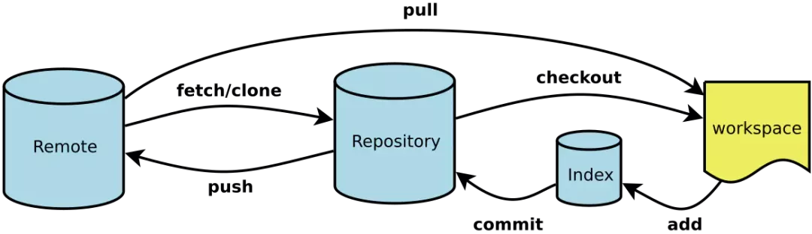
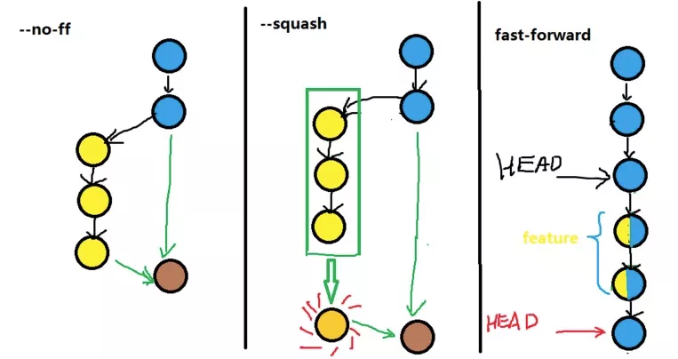

# Git 操作

## Git 流程图

[](docs/images/648.webp)

Workspace：工作区
Index / Stage：暂存区
Repository：仓库区（或本地仓库）
Remote：远程仓库

## 配置 Git

```shell
# 配置全局用户
$ git config --global user.name "用户名"
$ git config --global user.email "git账号"
# 配置别名
$ git config --global alias.co checkout
$ git config --global alias.ss status
$ git config --global alias.cm commit
$ git config --global alias.br branch
$ git config --global alias.rg reflog
# 这里只是美化 log 的输出，实际使用时可以在 git lg 后面加命令参数，如：git lg -10 显示最近10条提交
$ git config --global alias.lg "log --color --graph --pretty=format:'%Cred%h%Creset -%C(yellow)%d%Creset %s %Cgreen(%cr) %C(bold blue)<%an>%Creset' --abbrev-commit"
# 删除全局配置
$ git config --global --unset alias.xxx
$ git config --global --unset user.xxx

```


## 查看 Git 信息

```shell
# 查看系统配置
$ git config --list
# 查看用户配置
$ cat ~/.gitconfig
# 查看当前项目的 git 配置
$ cat .git/config
# 查看暂存区的文件
$ git ls-files
# 查看本地 git 命令历史
$ git reflog
# 查看所有 git 命令
$ git --help -a
# 查看当前 HEAD 指向
$ cat .git/HEAD

# git 中 D 向下翻一行  F 向下翻页  B 向上翻页  Q 退出
# 查看提交历史
$ git log --oneline
          --grep="关键字"
          --graph
          --all
          --author "username"
          --reverse
          -num
          -p
          --before=  1  day/1  week/1  "2019-06-06"
          --after= "2019-06-06"
          --stat
          --abbrev-commit
          --pretty=format:"xxx"
          
# oneline -> 将日志记录一行一行的显示
# grep="关键字" -> 查找日志记录中(commit提交时的注释)与关键字有关的记录
# graph -> 记录图形化显示 ！！！
# all -> 将所有记录都详细的显示出来
# author "username" -> 查找这个作者提交的记录
# reverse -> commit 提交记录顺序翻转
# before -> 查找规定的时间(如:1天/1周)之前的记录
# num -> git log -10 显示最近10次提交 ！！！
# stat -> 显示每次更新的文件修改统计信息，会列出具体文件列表 ！！！
# abbrev-commit -> 仅显示 SHA-1 的前几个字符，而非所有的 40 个字符 ！！！
# pretty=format:"xxx" ->  可以定制要显示的记录格式 ！！！
# p -> 显示每次提交所引入的差异（按 补丁 的格式输出）！！！
```

## git reflog

「显示的是一个 HEAD 指向发生改变的时间列表」。在你切换分支、用 `git commit `进行提交、以及用 `git reset` 撤销 `commit` `时，HEAD` 指向会改变，但当你进行 `git checkout -- <filename>` 撤销或者 `git stash ` `存储文件等操作时，HEAD` 并不会改变，这些修改从来没有被提交过，因此 `reflog` 也无法帮助我们恢复它们。
`git reflog `不会永远保持，Git 会定期清理那些 “用不到的” 对象，不要指望几个月前的提交还一直在那里。

## git log 点线图

「git 中一条分支就是一个指针，新建一条分支就是基于当前指针新建一个指针」
「切换至某个分支 ，就是将 HEAD 指向某条分支（指针）」
「切换至某个 commit ，就是将 HEAD 指向某个 commit」

符号解释：

```shell
*	表示一个 commit
|	表示分支前进
/	表示分叉
\	表示合入
|/	表示新分支
```

##  Git 常用命令

```shell
# 查看工作区和暂存区的状态
$ git status
# 将工作区的文件提交到暂存区
$ git add .
# 提交到本地仓库
$ git commit -m "本次提交说明"
# add和commit的合并，便捷写法（未追踪的文件无法直接提交到暂存区/本地仓库）
$ git commit -am "本次提交说明"
# 将本地分支和远程分支进行关联
$ git push -u origin branchName
# 将本地仓库的文件推送到远程分支
$ git push
# 拉取远程分支的代码
$ git pull origin branchName
# 合并分支
$ git merge branchName
# 查看本地拥有哪些分支
$ git branch
# 查看所有分支（包括远程分支和本地分支）
$ git branch -a
# 切换分支
$ git checkout branchName
# 临时将工作区文件的修改保存至堆栈中
$ git stash
# 将之前保存至堆栈中的文件取出来
$ git stash pop
 
```

## Git 常用命令详解

add 将工作区的文件添加到暂存区

```shell
# 添加指定文件到暂存区（追踪新增的指定文件）
$ git add [file1] [file2] ...
# 添加指定目录到暂存区，包括子目录
$ git add [dir]
# 添加当前目录的所有文件到暂存区（追踪所有新增的文件）
$ git add .
# 删除工作区/暂存区的文件
$ git rm [file1] [file2] ...
# 停止追踪指定文件，但该文件会保留在工作区
$ git rm --cached [file]
# 改名工作区/暂存区的文件
$ git mv [file-original] [file-renamed]

# Git 2.0 以下版本
#只作用于文件的新增和修改
$ git add .
#只作用于文件的修改和删除
$ gti add -u
#作用于文件的增删改
$ git add -A

# Git 2.0 版本
$ git add . 等价于 $ git add -A
```

「git add .」 ：「操作的对象是“当前目录”所有文件变更」，"."  表示当前目录。会监控工作区的状态树，使用它会把工作区的「所有变化提交」到暂存区，包括文件内容修改（modified）以及新文件（new），但「不包括被删除的文件」。
「git add -u」 ：「操作的对象是整个工作区已经跟踪的文件变更，无论当前位于哪个目录下」。仅监控「已经被 add 的文件」（即 「tracked file」），它会将被修改的文件（包括文件删除）提交到暂存区。git add -u 不会提交新文件（「untracked file」）。（「git add --update」 的缩写）
「git add -A」 ：「操作的对象是“整个工作区”所有文件的变更，无论当前位于哪个目录下」。是上面两个功能的合集（git add --all 的缩写）。

status

```shell
# 查看工作区和暂存区的状态
$ git status
 
```

commit

```shell
# 将暂存区的文件提交到本地仓库并添加提交说明
$ git commit -m "本次提交的说明"

# add 和 commit 的合并，便捷写法
# 和 git add -u 命令一样，未跟踪的文件是无法提交上去的
$ git commit -am "本次提交的说明"

# 跳过验证继续提交
$ git commit --no-verify
$ git commit -n

# 编辑器会弹出上一次提交的信息，可以在这里修改提交信息
$ git commit --amend
# 修复提交，同时修改提交信息
$ git commit --amend -m "本次提交的说明"
# 加入 --no-edit 标记会修复提交但不修改提交信息，编辑器不会弹出上一次提交的信息
$ git commit --amend --no-edit
 
```

git commit --amend 既可以修改上次提交的文件内容，也可以修改上次提交的说明。会用一个新的 commit 更新并替换最近一次提交的 commit 。如果暂存区有内容，这个新的 commit 会把任何修改内容和上一个 commit 的内容结合起来。如果暂存区没有内容，那么这个操作就只会把上次的 commit 消息重写一遍。「永远不要修复一个已经推送到公共仓库中的提交，会拒绝推送到仓库」

push & pull  
分支推送顺序的写法是 「<来源地>:<目的地>」

```shell
# 将本地仓库的文件推送到远程分支
# 如果远程仓库没有这个分支，会新建一个同名的远程分支
# 如果省略远程分支名，则表示两者同名
$ git push <远程主机名> <本地分支名>:<远程分支名>
$ git push origin branchname

# 如果省略本地分支名，则表示删除指定的远程分支
# 因为这等同于推送一个空的本地分支到远程分支。
$ git push origin :master
# 等同于
$ git push origin --delete master

# 建立当前分支和远程分支的追踪关系
$ git push -u origin master
# 如果当前分支与远程分支之间存在追踪关系
# 则可以省略分支和 -u
$ git push

# 不管是否存在对应的远程分支，将本地的所有分支都推送到远程主机
$ git push --all origin

# 拉取所有远程分支到本地镜像仓库中
$ git pull
# 拉取并合并项目其他人员的一个分支
$ git pull origin branchname
# 等同于 fetch + merge
$ git fetch origin branchName
$ git merge origin/branchName

# 如果远程主机的版本比本地版本更新，推送时 Git 会报错，要求先在本地做 git pull 合并差异，
# 然后再推送到远程主机。这时，如果你一定要推送，可以使用 –-force 选项
# （尽量避免使用）
$ git push --force origin | git push -f origin
 
```

branch

```shell
# 查看本地分支
$ git branch | git branch -l
# 查看远程分支
$ git branch -r
# 查看所有分支（本地分支+远程分支）
$ git branch -a
# 查看所有分支并带上最新的提交信息
$ git branch -av
# 查看本地分支对应的远程分支
$ git branch -vv

# 新建分支
# 在别的分支下新建一个分支，新分支会复制当前分支的内容
# 注意：如果当前分支有修改，但是没有提交到仓库，此时修改的内容是不会被复制到新分支的
$ git branch branchname
# 切换分支(切换分支时，本地工作区，仓库都会相应切换到对应分支的内容)
$ git checkout branchname
# 创建一个 aaa 分支，并切换到该分支 （新建分支和切换分支的简写）
$ git checkout -b aaa
# 可以看做是基于 master 分支创建一个 aaa 分支，并切换到该分支
$ git checkout -b aaa master

# 新建一条空分支（详情请看问题列表）
$ git checkout --orphan emptyBranchName
$ git rm -rf .

# 删除本地分支,会阻止删除包含未合并更改的分支
$ git brnach -d branchname
# 强制删除一个本地分支，即使包含未合并更改的分支
$ git branch -D branchname
# 删除远程分支
# 推送一个空分支到远程分支，其实就相当于删除远程分支
$ git push origin  :远程分支名
# 或者
$ git push origin --delete 远程分支名

# 修改当前分支名
$ git branch -m branchname
 
```

merge 三种常用合并方法

```shell
# 默认 fast-forward ，HEAD 指针直接指向被合并的分支
$ git merge

# 禁止快进式合并
$ git merge --no-ff

$ git merge --squash
```
[](docs/images/649.webp)

fast-forward：会在当前分支的提交历史中添加进被合并分支的提交历史（「得先理解什么时候会发生快速合并，并不是每次 merge 都会发生快速合并」）；
--no-ff：「会生成一个新的提交」，让当前分支的提交历史不会那么乱；
--squash：「不会生成新的提交」，会将被合并分支多次提交的内容直接存到工作区和暂存区，由开发者手动去提交，这样当前分支最终只会多出一条提交记录，不会掺杂被合并分支的提交历史


## 清理已合并分支
```shell
git branch --merged | egrep -v "(^\*|master|dev)" | xargs git branch -d
```
## 同步清理后的远程分支
```shell
git pull --prune
```
## 输出维护者信息
```shell
# https://github.com/standard/standard/blob/master/bin/update-authors.sh
git log --reverse --format='%aN (%aE)' | perl -we '
BEGIN {
  %seen = (), @authors = ();
}
while (<>) {
  next if $seen{$_};
  $seen{$_} = push @authors, "- ", $_;
}
END {
  print "# Authors\n\n";
  print "#### Ordered by first contribution.\n\n";
  print @authors, "\n";
}
'
```


参考： https://juejin.im/post/5ee649ff51882542ea2b5108