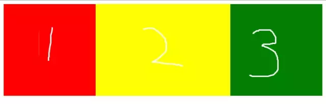

# 前端面试基础题集合

一、html和css部分

## 如何理解CSS的盒子模型？

标准盒子模型： `宽度=内容的宽度（content）+ border + padding` 

低版本IE盒子模型： `宽度=内容宽度（content+border+padding）` 

## BF

* 什么是 BFC

   BFC（Block Formatting Context）格式化上下文，是 Web 页面中盒模型布局的 CSS 渲染模式，指一个独立的渲染区域或者说是一个隔离的独立容器。

* 形成 BFC 的条件

   * 浮动元素，float 除 none 以外的值
   * 定位元素，position（absolute，fixed）
   * display 为以下其中之一的值 inline-block，table-cell，table-caption
   * overflow 除了 visible 以外的值（hidden，auto，scroll）

* BFC 的特性

   * 内部的 Box 会在垂直方向上一个接一个的放置。
   * 垂直方向上的距离由 margin 决定
   * bfc 的区域不会与 float 的元素区域重叠。
   * 计算 bfc 的高度时，浮动元素也参与计算
   * bfc 就是页面上的一个独立容器，容器里面的子元素不会影响外面元素。

## 如何清除浮动？

不清楚浮动会发生高度塌陷：浮动元素父元素高度自适应（父元素不写高度时，子元素写了浮动后，父元素会发生高度塌陷）

* clear清除浮动（添加空div法）在浮动元素下方添加空div, 并给该元素写css样式：{clear:both; height:0; overflow:hidden; }
* 给浮动元素父级设置高度
* 父级同时浮动（需要给父级同级元素添加浮动）
* 父级设置成inline-block，其margin: 0 auto居中方式失效
* 给父级添加overflow:hidden 清除浮动方法
* 万能清除法 after伪类 清浮动（现在主流方法，推荐使用）

``` javascript
.float_div: after {
        content: ".";
        clear: both;
        display: block;
        height: 0;
        overflow: hidden;
        visibility: hidden;
    }
    .float_div {
        zoom: 1
    }
```

## 用纯CSS创建一个三角形的原理是什么？

``` css
span {
    width: 0;
    height: 0;
    border-top: 40px solid transparent;
    border-left: 40px solid transparent;
    border-right: 40px solid transparent;
    border-bottom: 40px solid #ff0000;
}
```

[](docs/images/640.webp)

## css3实现0.5px的细线？

``` css
/* css */
.line {
    position: relative;
}

.line:after {
    content: "";
    position: absolute;
    left: 0;
    top: 0;
    width: 100%;
    height: 1px;
    background-color: #000000;
    -webkit-transform: scaleY(.5);
    transform: scaleY(.5);
}

/* html */
<div class="line"></div>
```

## css实现三栏布局

左右固定，中间自适应。
[](docs/images/641.webp)
(1)flex方式

``` html
<!DOCTYPE html>
<html lang="en">

<head>
    <meta charset="UTF-8">
    <meta name="viewport" content="width=device-width, initial-scale=1.0">
    <meta http-equiv="X-UA-Compatible" content="ie=edge">
    <title>Document</title>
    <style>
        .box {
            display: flex;
            justify-content: center;
            height: 200px;
        }

        .left {
            width: 200px;
            background-color: red;
            height: 100%;
        }

        .content {
            background-color: yellow;
            flex: 1;
        }

        .right {
            width: 200px;
            background-color: green;
        }
    </style>
</head>

<body>
    <div class="box">
        <div class="left"></div>
        <div class="content"></div>
        <div class="right"></div>
    </div>
</body>

</html>
```

(2)绝对定位方式

``` html
<!DOCTYPE html>
<html lang="en">

<head>
    <meta charset="UTF-8">
    <meta name="viewport" content="width=device-width, initial-scale=1.0">
    <meta http-equiv="X-UA-Compatible" content="ie=edge">
    <title>Document</title>
    <style>
        .box {
            position: relative;
            height: 200px;
        }

        .left {
            width: 200px;
            background-color: red;
            left: 0;
            height: 100%;
            position: absolute;
        }

        .content {
            background-color: yellow;
            left: 200px;
            right: 200px;
            height: 100%;
            position: absolute;
        }

        .right {
            width: 200px;
            background-color: green;
            right: 0;
            height: 100%;
            position: absolute;
        }
    </style>
</head>

<body>
    <div class="box">
        <div class="left"></div>
        <div class="content"></div>
        <div class="right"></div>
    </div>
</body>

</html>
```

(3)浮动方式

``` html
<!DOCTYPE html>
<html lang="en">

<head>
    <meta charset="UTF-8">
    <meta name="viewport" content="width=device-width, initial-scale=1.0">
    <meta http-equiv="X-UA-Compatible" content="ie=edge">
    <title>Document</title>
    <style>
        .box {
            height: 200px;
        }

        .left {
            width: 200px;
            background-color: red;
            float: left;
            height: 100%;
        }

        .content {
            background-color: yellow;
            height: 100%;
        }

        .right {
            width: 200px;
            background-color: green;
            float: right;
            height: 100%;
        }
    </style>
</head>

<body>
    <div class="box">
        <div class="left"></div>
        <div class="right"></div>
        <div class="content"></div>
    </div>
</body>

</html>
```

## 让一个div垂直居中

[](docs/images/642.webp)

(1)宽度和高度已知的

``` html
<!DOCTYPE html>
<html lang="en">

<head>
    <meta charset="UTF-8">
    <meta name="viewport" content="width=device-width, initial-scale=1.0">
    <meta http-equiv="X-UA-Compatible" content="ie=edge">
    <title>Document</title>
    <style>
        .box {
            width: 400px;
            height: 200px;
            position: relative;
            background: red;
        }

        .content {
            width: 200px;
            height: 100px;
            position: absolute;
            top: 50%;
            left: 50%;
            margin-left: -100px;
            margin-top: -50px;
            background: green;
        }
    </style>
</head>

<body>
    <div class="box">
        <div class="content"></div>
    </div>
</body>

</html>
```

(2)宽度和高度未知

``` html
<!DOCTYPE html>
<html lang="en">

<head>
    <meta charset="UTF-8">
    <meta name="viewport" content="width=device-width, initial-scale=1.0">
    <meta http-equiv="X-UA-Compatible" content="ie=edge">
    <title>Document</title>
    <style>
        .box {
            width: 400px;
            height: 200px;
            position: relative;
            background: red;
        }

        .content {
            position: absolute;
            top: 50%;
            left: 50%;
            transform: translate(-50%, -50%);
            background: green;
        }
    </style>
</head>

<body>
    <div class="box">
        <div class="content"></div>
    </div>
</body>

</html>
```

(3)flex布局

``` html
<!DOCTYPE html>
<html lang="en">

<head>
    <meta charset="UTF-8">
    <meta name="viewport" content="width=device-width, initial-scale=1.0">
    <meta http-equiv="X-UA-Compatible" content="ie=edge">
    <title>Document</title>
    <style>
        .box {
            width: 400px;
            height: 200px;
            background: red;
            display: flex;
            justify-content: center;
            align-items: center;
        }

        .content {
            width: 200px;
            height: 100px;
            background: green;
        }
    </style>
</head>

<body>
    <div class="box">
        <div class="content"></div>
    </div>
</body>

</html>
```

二、JS

## 闭包

闭包概念
能够读取其他函数内部变量的函数。
或简单理解为定义在一个函数内部的函数，内部函数持有外部函数内变量的引用。

闭包用途
1、读取函数内部的变量
2、让这些变量的值始终保持在内存中。不会再f1调用后被自动清除。
3、方便调用上下文的局部变量。利于代码封装。
原因：f1是f2的父函数，f2被赋给了一个全局变量，f2始终存在内存中，f2的存在依赖f1，因此f1也始终存在内存中，不会在调用结束后，被垃圾回收机制回收。

闭包缺点
1、由于闭包会使得函数中的变量都被保存在内存中，内存消耗很大，所以不能滥用闭包，否则会造成网页的性能问题，在IE中可能导致内存泄露。解决方法是，在退出函数之前，将不使用的局部变量全部删除。
2、闭包会在父函数外部，改变父函数内部变量的值。所以，如果你把父函数当作对象（object）使用，把闭包当作它的公用方法（Public Method），把内部变量当作它的私有属性（private value），这时一定要小心，不要随便改变父函数内部变量的值。

闭包应用场景 
闭包应用场景之setTimeout

[](docs/images/643.webp)

闭包应用场景之回调
[](docs/images/644.webp)

## js中函数执行

在 ES5.1 里面函数是这样执行的（不讨论use strict和一些特殊情况，JS好复杂的），按如下顺序执行：

1. 确定“this”的值 (确切的来说，this在JS里面不是一个变量名而是一个关键字)
2. 创建一个新的作用域
3. 处理形参/实参（没有定义过才声明，无论如何都重新赋值，没有对应实参则赋值为"undefined"）：

对于每一个传入的实参，按照从左往右的顺序依次执行：如果对应的形参在本作用域中还没有定义，则在本作用域中声明形参，并赋值。如果已经定义过了，则重新给其赋值。(没有对应实参则赋值为"undefined"）（没有定义：就是“没有声明”的意思）

4. 处理函数定义（没有定义过才声明，无论如何都重新赋值）：

对该函数中所有的定义的函数，按照代码写的顺序依次执行：如果这个变量名在本作用域中还没有定义，则在本作用域中声明这个函数名，并且赋值为对应的函数，如果定义了这个变量，在可写的情况下重新给这个变量赋值为这个函数，否则抛出异常。

5. 处理 "arguments"（没有定义过才声明和赋值）:

如果在本作用域中没有定义 arguments，则在本作用域中声明arguments并给其赋值。

6. 处理变量声明（没有定义过才声明，不赋值）：

对于所有变量声明，按照代码写的顺序依次执行：如果在本作用域中没有定义这个变量，则在本作用域中声明这个变量，赋值为undefined

7. 然后执行函数代码。（当然是去变量定义里面的 var 执行）

## new一个对象的过程中发生了什么嘛

1. 创建空对象；

``` javascript
var obj = {};
```

2. 设置新对象的constructor属性为构造函数的名称，设置新对象的__proto__属性指向构造函数的prototype对象；

``` javascript
obj.__proto__ = ClassA.prototype;
```

3. 使用新对象调用函数，函数中的this被指向新实例对象：

``` javascript
ClassA.call(obj); //{}.构造函数();
```

4. 将初始化完毕的新对象地址，保存到等号左边的变量中

## 宏任务跟微任务

`macro-task(` 宏任务)：包括整体代码 `script` ， `setTimeout` ， `setInteral` 
`micro-task` (微任务)： `Promise` ， `process.nextTick` 

## 防抖和节流

综合应用场景

防抖(debounce): 就是指触发事件后在 n 秒内函数只能执行一次，如果在 n 秒内又触发了事件，则会重新计算函数执行时间。

search搜索联想，用户在不断输入值时，用防抖来节约请求资源。

window触发resize的时候，不断的调整浏览器窗口大小会不断的触发这个事件，用防抖来让其只触发一次

节流(throttle): 就是指连续触发事件但是在 n 秒中只执行一次函数。节流会稀释函数的执行频率。

鼠标不断点击触发，mousedown(单位时间内只触发一次)

监听滚动事件，比如是否滑到底部自动加载更多，用throttle来判断 所谓防抖，就是指触发事件后在 n 秒内函数只能执行一次，如果在 n 秒内又触发了事件，则会重新计算函数执行时间。

防抖函数分为非立即执行版和立即执行版。

非立即执行版的意思是触发事件后函数不会立即执行，而是在 n 秒后执行，如果在 n 秒内又触发了事件，则会重新计算函数执行时间。

立即执行版的意思是触发事件后函数会立即执行，然后 n 秒内不触发事件才能继续执行函数的效果。

``` javascript
/**
 * @desc 函数防抖
 * @param func 函数
 * @param wait 延迟执行毫秒数
 * @param immediate true 表立即执行，false 表非立即执行
 */
function debounce(func, wait, immediate) {
    let timeout;

    return function() {
        let context = this;
        let args = arguments;

        if (timeout) clearTimeout(timeout);
        if (immediate) {
            var callNow = !timeout;
            timeout = setTimeout(() => {
                timeout = null;
            }, wait)
            if (callNow) func.apply(context, args)
        } else {
            timeout = setTimeout(function() {
                func.apply(context, args)
            }, wait);
        }
    }
}
```

所谓节流，就是指连续触发事件但是在 n 秒中只执行一次函数。节流会稀释函数的执行频率。

对于节流，一般有两种方式可以实现，分别是时间戳版和定时器版。

时间戳版的函数触发是在时间段内开始的时候

定时器版的函数触发是在时间段内结束的时候。

``` javascript
/**
 * @desc 函数节流
 * @param func 函数
 * @param wait 延迟执行毫秒数
 * @param type 1 表时间戳版，2 表定时器版
 */
function throttle(func, wait, type) {
    if (type === 1) {
        let previous = 0;
    } else if (type === 2) {
        let timeout;
    }
    return function() {
        let context = this;
        let args = arguments;
        if (type === 1) {
            let now = Date.now();

            if (now - previous > wait) {
                func.apply(context, args);
                previous = now;
            }
        } else if (type === 2) {
            if (!timeout) {
                timeout = setTimeout(() => {
                    timeout = null;
                    func.apply(context, args)
                }, wait)
            }
        }
    }
}
```

## 数组的常用方法

改变原数组的方法

splice() 添加/删除数组元素
语法：arrayObject.splice(index, howmany, item1, ....., itemX)
参数:
   1.index：必需。整数，规定添加/删除项目的位置，使用负数可从数组结尾处规定位置。
   2.howmany：可选。要删除的项目数量。如果设置为 0，则不会删除项目。
   3.item1, ..., itemX：可选。向数组添加的新项目。

返回值: 如果有元素被删除, 返回包含被删除项目的新数组。

sort() 数组排序
语法：arrayObject.sort(sortby)
参数:
   1.sortby可选。规定排序顺序。必须是函数。。

返回值: 返回包排序后的新数组。

pop() 删除一个数组中的最后的一个元素
语法：arrayObject.pop()
参数: 无

返回值: 返回被删除的元素。

shift() 删除数组的第一个元素
语法：arrayObject.shift()
参数: 无

返回值: 返回被删除的元素。

push() 向数组的末尾添加元素
语法：arrayObject.push(newelement1, newelement2, ...., newelementX)
参数:
   1.newelement1必需。要添加到数组的第一个元素。
   2.newelement2可选。要添加到数组的第二个元素。
   3.newelementX可选。可添加若干个元素。

返回值: 返回被删除的元素。

unshift() 向数组的开头添加一个或更多元素
语法：arrayObject.unshift(newelement1, newelement2, ...., newelementX)
参数:
   1.newelement1必需。要添加到数组的第一个元素。
   2.newelement2可选。要添加到数组的第二个元素。
   3.newelementX可选。可添加若干个元素。

返回值: arrayObject 的新长度。。

reverse() 颠倒数组中元素的顺序
语法：arrayObject.reverse()
参数: 无

返回值: 颠倒后的新数组。

copyWithin() 指定位置的成员复制到其他位置
语法：array.copyWithin(target, start = 0, end = this.length)
参数:
   1.target（必需）：从该位置开始替换数据。如果为负值，表示倒数。
   2.start（可选）：从该位置开始读取数据，默认为 0。如果为负值，表示倒数。
   3.end（可选）：到该位置前停止读取数据，默认等于数组长度。如果为负值，表示倒数。

返回值: 返回当前数组。

fill() 填充数组
语法：array.fill(value, start, end)
参数:
   1.value必需。填充的值。
   2.start可选。开始填充位置。
   3.end可选。停止填充位置 (默认为 array.length)

返回值: 返回当前数组。

不改变原数组的方法

slice() 浅拷贝数组的元素
语法：array.slice(begin, end); 
参数:
   1.begin(可选): 索引数值, 接受负值，从该索引处开始提取原数组中的元素, 默认值为0。
   2.end(可选): 索引数值(不包括), 接受负值，在该索引处前结束提取原数组元素，默认值为数组末尾(包括最后一个元素)。

返回值: 返回一个从开始到结束（不包括结束）选择的数组的一部分浅拷贝到一个新数组对象，且原数组不会被修改。

join() 数组转字符串
语法：array.join(str)
参数:
   1.str(可选): 指定要使用的分隔符，默认使用逗号作为分隔符。

返回值: 返回生成的字符串。

concat() 合并两个或多个数组
语法：var newArr =oldArray.concat(arrayX, arrayX, ......, arrayX)
参数:
   1.arrayX（必须）：该参数可以是具体的值，也可以是数组对象。可以是任意多个。

返回值: 返回返回合并后的新数组。

indexOf() 查找数组是否存在某个元素
语法：array.indexOf(searchElement, fromIndex)
参数:
   1.searchElement(必须): 被查找的元素
   2.fromIndex(可选): 开始查找的位置(不能大于等于数组的长度，返回-1)，接受负值，默认值为0。

返回值: 返回下标

lastIndexOf() 查找指定元素在数组中的最后一个位置
语法：arr.lastIndexOf(searchElement, fromIndex)
参数:
   1.searchElement(必须): 被查找的元素
   2.fromIndex(可选): 逆向查找开始位置，默认值数组的长度-1，即查找整个数组。

返回值: 方法返回指定元素, 在数组中的最后一个的索引，如果不存在则返回 -1。（从数组后面往前查找）

includes() 查找数组是否包含某个元素
语法：array.includes(searchElement, fromIndex=0)
参数:
   1.searchElement(必须): 被查找的元素
   2.fromIndex(可选): 默认值为0，参数表示搜索的起始位置，接受负值。正值超过数组长度，数组不会被搜索，返回false。负值绝对值超过长数组度，重置从0开始搜索。

返回值: 返回布尔

## 立即执行函数

声明一个匿名函数，马上调用这个匿名函数。目的是保护内部变量不受污染。

``` javascript
(function(n1, n2) {
    console.log("这是匿名函数的自执行的第一种写法，结果为:" + (n1 + n2))
})(10, 100);
(function start(n1, n2) {
    console.log("这是函数声明方式的自执行的第一种写法，结果为:" + (n1 + n2))
})(10, 100);
(function(n1, n2) {
    console.log("这是匿名函数的自执行的第二种写法，结果为：" + (n1 + n2))
}(10, 100));
(function start(n1, n2) {
    console.log("这是函数声明方式的自执行的第二种写法，结果为：" + (n1 + n2))
}(10, 100));
```

## js原型和原型链
每个对象都会在其内部初始化一个属性，就是prototype(原型)，当我们访问一个对象的属性时，如果这个对象内部不存在这个属性，那么他就会去prototype里找这个属性，这个prototype又会有自己的prototype，于是就这样一直找下去，也就是我们平时所说的原型链的概念。

关系：instance.constructor.prototype = instance.proto

特点：JavaScript对象是通过引用来传递的，我们创建的每个新对象实体中并没有一份属于自己的原型副本，当我们修改原型时，与之相关的对象也会继承这一改变。当我们需要一个属性时，JavaScript引擎会先看当前对象中是否有这个属性，如果没有的话，就会查找它的prototype对象是否有这个属性，如此递推下去，一致检索到Object内建对象。

```javascript
function Func(){}
Func.prototype.name = "汪某";
Func.prototype.getInfo = function() {
   return this.name;
}
var person = new Func();
console.log(person.getInfo());//"汪某"
console.log(Func.prototype);//Func { name = "汪某", getInfo = function() }
```

##  Promise
一句话概括Promise：Promise对象用于异步操作，它表示一个尚未完成且预计在未来完成的异步操作。

promise是用来解决两个问题的：

回调地狱，代码难以维护，常常第一个的函数的输出是第二个函数的输入这种现象

promise可以支持多个并发的请求，获取并发请求中的数据

这个promise可以解决异步的问题，本身不能说promise是异步的

```javascript
/*Promise 的简单实现*/

class MyPromise {
    constructor(fn) {
        this.resolvedCallbacks = [];
        this.rejectedCallbacks = [];
        this.state = "PADDING";
        this.value = "";
        fn(this.resolve.bind(this), this.reject.bind(this));
    }
    resolve(value) {
        if (this.state === "PADDING") {
            this.state = "RESOLVED";
            this.value = value;
            this.resolvedCallbacks.forEach(cb => cb());
        }
    }
    reject(value) {
        if (this.state === "PADDING") {
            this.state = "REJECTED";
            this.value = value;
            this.rejectedCallbacks.forEach(cb => cb());
        }
    }
    then(resolve = function() {}, reject = function() {}) {
        if (this.state === "PADDING") {
            this.resolvedCallbacks.push(resolve);
            this.rejectedCallbacks.push(reject);
        }
        if (this.state === "RESOLVED") {
            resolve(this.value);
        }
        if (this.state === "REJECTED") {
            reject(this.value);
        }
    }
}
```

## async/await

如何使用 Async 函数
```javascript
async function timeout(ms) {
  await new Promise((resolve) => {
    setTimeout(resolve, ms);
  });
}

async function asyncPrint(value, ms) {
  await timeout(ms);
  console.log(value);
}

asyncPrint('hello world', 50);
```
上面代码指定50毫秒以后，输出hello world。进一步说，async函数完全可以看作多个异步操作，包装成的一个 Promise 对象，而await命令就是内部then命令的语法糖。

## 深拷贝、浅拷贝
浅拷贝和深拷贝都只针对于引用数据类型，浅拷贝只复制指向某个对象的指针，而不复制对象本身，新旧对象还是共享同一块内存；但深拷贝会另外创造一个一模一样的对象，新对象跟原对象不共享内存，修改新对象不会改到原对象；

区别：浅拷贝只复制对象的第一层属性、深拷贝可以对对象的属性进行递归复制；

[](docs/images/645.webp)

浅拷贝的实现方式

`. 自定义函数

```javascript
function simpleCopy (initalObj) {
   var obj = {};
   for ( var i in initalObj) {
    obj[i] = initalObj[i];
   }
   return obj;
}
```
2. ES6 的 Object.assign()

```javascript
let newObj = Object.assign({}, obj);
```

3. ES6 的对象扩展

```javascript
let newObj = {...obj};
```

深拷贝的实现方式

1. JSON.stringify 和 JSON.parse
用 JSON.stringify 把对象转换成字符串，再用 JSON.parse 把字符串转换成新的对象。

```javascript
let newObj = JSON.parse(JSON.stringify(obj));
```
2. lodash
用 lodash 函数库提供的 _.cloneDeep 方法实现深拷贝。

```javascript
var _ = require('lodash');
var newObj = _.cloneDeep(obj);
```
3. 自己封装

```javascript
function deepClone(obj) {
    let objClone = Array.isArray(obj) ? [] : {};
    if (obj && typeof obj === "object") {
        // for...in 会把继承的属性一起遍历
        for (let key in obj) {
            // 判断是不是自有属性，而不是继承属性
            if (obj.hasOwnProperty(key)) {
                //判断ojb子元素是否为对象或数组，如果是，递归复制
                if (obj[key] && typeof obj[key] === "object") {
                    objClone[key] = this.deepClone(obj[key]);
                } else {
                    //如果不是，简单复制
                    objClone[key] = obj[key];
                }
            }
        }
    }
    return objClone;
}
```

## 跨域
跨域需要针对浏览器的同源策略来理解，同源策略指的是请求必须是同一个端口，同一个协议，同一个域名，不同源的客户端脚本在没有明确授权的情况下，不能读写对方资源。

受浏览器同源策略的影响，不是同源的脚本不能操作其他源下面的对象。想要操作另一个源下的对象是就需要跨域。

1. jsonp
2. iframe
3. 跨域资源共享(CORS)
4. nginx 代理跨域

## for in 和 for of

for in

1.一般用于遍历对象的可枚举属性。以及对象从构造函数原型中继承的属性。对于每个不同的属性，语句都会被执行。
2.不建议使用for in 遍历数组，因为输出的顺序是不固定的。
3.如果迭代的对象的变量值是null或者undefined, for in不执行循环体，建议在使用for in循环之前，先检查该对象的值是不是null或者undefined

for of

1.for…of 语句在可迭代对象（包括 Array，Map，Set，String，TypedArray，arguments 对象等等）上创建一个迭代循环，调用自定义迭代钩子，并为每个不同属性的值执行语句

遍历对象

```javascript
var s = {
    a: 1,
    b: 2,
    c: 3
}
var s1 = Object.create(s);
for (var prop in s1) {
    console.log(prop); //a b c
    console.log(s1[prop]); //1 2 3
}
for (let prop of s1) {
    console.log(prop); //报错如下 Uncaught TypeError: s1 is not iterable
}
for (let prop of Object.keys(s1)) {
    console.log(prop); // a b c
    console.log(s1[prop]); //1 2 3
}
```

## 如何阻止冒泡？

冒泡型事件：事件按照从最特定的事件目标到最不特定的事件目标(document对象)的顺序触发。

w3c的方法是e.stopPropagation()，IE则是使用e.cancelBubble = true。

```javascript
//阻止冒泡行为
function stopBubble(e) {
//如果提供了事件对象，则这是一个非IE浏览器
if ( e && e.stopPropagation )
    //因此它支持W3C的stopPropagation()方法
    e.stopPropagation();
else 
    //否则，我们需要使用IE的方式来取消事件冒泡
    window.event.cancelBubble = true;
}
```

## 如何阻止默认事件？
w3c的方法是e.preventDefault()，IE则是使用e.returnValue = false

```javascript
//阻止浏览器的默认行为
function stopDefault( e ) {
    //阻止默认浏览器动作(W3C)
    if ( e && e.preventDefault )
        e.preventDefault();
    //IE中阻止函数器默认动作的方式
    else 
        window.event.returnValue = false;
    return false;
}
```

## var,let,const

```javascript
//变量提升
console.log(a);  // undefined
console.log(b);  // 报错
console.log(c);  // 报错
var a = 1;
let b = 2;
const c = 3;

// 全局声明
console.log(window.a) //  1

// 重复声明
let b  = 200;//报错
```

其实这里很容易理解，var是可以变量提升的。而let和const是必须声明后才能调用的。对于let和const来说，这里就是暂缓性死区。

[](docs/images/646.png)

## Class
es6新增的Class其实也是语法糖，js底层其实没有class的概念的，其实也是原型继承的封装。

```javascript
class People {
    constructor(props) {
        this.props = props;
        this.name = '汪某';
    }
    callMyName() {
        console.log(this.name);
    }
}
class Name extends People { // extends 其实就是继承了哪个类
    constructor(props) {
        //  super相当于 把类的原型拿过来
        //  People.call(this, props)
        super(props)
    }
    callMyApple() {
        console.log('我是汪某！')
    }
}

let a = new Name('啊啊啊')
a.callMyName(); //汪某
a.callMyApple(); // 我是汪某！
```

## 实现一个new操作符

```javascript
function New(func) {
    var res = {};
    if (func.prototype !== null) {
        res.__proto__ = func.prototype;
    }
    var ret = func.apply(res, Array.prototype.slice.call(arguments, 1));
    if ((typeof ret === "object" || typeof ret === "function") && ret !== null) {
        return;
        ret;
    }
    return;
    res;
}
var obj = New(A, 1, 2);
// equals to
var obj = new A(1, 2);
```