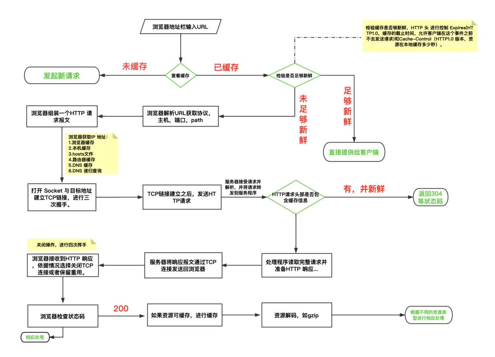

# 2020前端面试


## 强缓存与协商缓存
在工作中，前端代码打包之后的生成的静态资源就要发布到静态服务器上，这时候就要做对这些静态资源做一些运维配置，其中，gzip和设置缓存是必不可少的。这两项是最直接影响到网站性能和用户体验的。

缓存的优点：

- 减少了不必要的数据传输，节省带宽
- 减少服务器的负担，提升网站性能
- 加快了客户端加载网页的速度
- 用户体验友好

缺点：

资源如果有更改但是客户端不及时更新会造成用户获取信息滞后，如果老版本有bug的话，情况会更加糟糕。

所以，为了避免设置缓存错误，掌握缓存的原理对于我们工作中去更加合理的配置缓存是非常重要的。

一、强缓存
到底什么是强缓存？强在哪？其实强是强制的意思。当浏览器去请求某个文件的时候，服务端就在respone header里面对该文件做了缓存配置。缓存的时间、缓存类型都由服务端控制，具体表现为：
respone header 的cache-control，常见的设置是max-age public private no-cache no-store等
例如： cahe-control:max-age=31536000,public,immutable

max-age表示缓存的时间是31536000秒（1年），public表示可以被浏览器和代理服务器缓存，代理服务器一般可用nginx来做。immutable表示该资源永远不变，但是实际上该资源并不是永远不变，它这么设置的意思是为了让用户在刷新页面的时候不要去请求服务器！啥意思？就是说，如果你只设置了cahe-control:max-age=31536000,public 这属于强缓存，每次用户正常打开这个页面，浏览器会判断缓存是否过期，没有过期就从缓存中读取数据；但是有一些 "聪明" 的用户会点击浏览器左上角的刷新按钮去刷新页面，这时候就算资源没有过期（1年没这么快过），浏览器也会直接去请求服务器，这就是额外的请求消耗了，这时候就相当于是走协商缓存的流程了（下面会讲到）。如果cahe-control:max-age=315360000,public再加个immutable的话，就算用户刷新页面，浏览器也不会发起请求去服务，浏览器会直接从本地磁盘或者内存中读取缓存并返回200状态，看上图的红色框（from memory cache）。这是2015年facebook团队向制定 HTTP 标准的 IETF 工作组提到的建议：他们希望 HTTP 协议能给 Cache-Control 响应头增加一个属性字段表明该资源永不过期，浏览器就没必要再为这些资源发送条件请求了。


强缓存总结
cache-control: max-age=xxxx，public
客户端和代理服务器都可以缓存该资源；
客户端在xxx秒的有效期内，如果有请求该资源的需求的话就直接读取缓存,statu code:200 ，如果用户做了刷新操作，就向服务器发起http请求

cache-control: max-age=xxxx，private
只让客户端可以缓存该资源；代理服务器不缓存
客户端在xxx秒内直接读取缓存,statu code:200

cache-control: max-age=xxxx，immutable
客户端在xxx秒的有效期内，如果有请求该资源的需求的话就直接读取缓存,statu code:200 ，即使用户做了刷新操作，也不向服务器发起http请求

cache-control: no-cache
跳过设置强缓存，但是不妨碍设置协商缓存；一般如果你做了强缓存，只有在强缓存失效了才走协商缓存的，设置了no-cache就不会走强缓存了，每次请求都回询问服务端。

cache-control: no-store
不缓存，这个会让客户端、服务器都不缓存，也就没有所谓的强缓存、协商缓存了。


二、协商缓存
上面说到的强缓存就是给资源设置个过期时间，客户端每次请求资源时都会看是否过期；只有在过期才会去询问服务器。所以，强缓存就是为了给客户端自给自足用的。而当某天，客户端请求该资源时发现其过期了，这是就会去请求服务器了，而这时候去请求服务器的这过程就可以设置协商缓存。这时候，协商缓存就是需要客户端和服务器两端进行交互的。

怎么设置协商缓存？

response header里面的设置
```json
etag: '5c20abbd-e2e8'
last-modified: Mon, 24 Dec 2018 09:49:49 GMT
```

etag：每个文件有一个，改动文件了就变了，就是个文件hash，每个文件唯一，就像用webpack打包的时候，每个资源都会有这个东西，如： app.js打包后变为 app.c20abbde.js，加个唯一hash，也是为了解决缓存问题。

last-modified：文件的修改时间，精确到秒

也就是说，每次请求返回来 response header 中的 etag和 last-modified，在下次请求时在 request header 就把这两个带上，服务端把你带过来的标识进行对比，然后判断资源是否更改了，如果更改就直接返回新的资源，和更新对应的response header的标识etag、last-modified。如果资源没有变，那就不变etag、last-modified，这时候对客户端来说，每次请求都是要进行协商缓存了，即：

发请求-->看资源是否过期-->过期-->请求服务器-->服务器对比资源是否真的过期-->没过期-->返回304状态码-->客户端用缓存的老资源。

这就是一条完整的协商缓存的过程。

当然，当服务端发现资源真的过期的时候，会走如下流程：

发请求-->看资源是否过期-->过期-->请求服务器-->服务器对比资源是否真的过期-->过期-->返回200状态码-->客户端如第一次接收该资源一样，记下它的cache-control中的max-age、etag、last-modified等。

所以协商缓存步骤总结：

请求资源时，把用户本地该资源的 etag 同时带到服务端，服务端和最新资源做对比。
如果资源没更改，返回304，浏览器读取本地缓存。
如果资源有更改，返回200，返回最新的资源。

补充一点，response header中的etag、last-modified在客户端重新向服务端发起请求时，会在request header中换个key名：

```json
// response header
etag: '5c20abbd-e2e8'
last-modified: Mon, 24 Dec 2018 09:49:49 GMT

// request header 变为
if-none-matched: '5c20abbd-e2e8'
if-modified-since: Mon, 24 Dec 2018 09:49:49 GMT
```

为什么要有etag？
你可能会觉得使用last-modified已经足以让浏览器知道本地的缓存副本是否足够新，为什么还需要etag呢？HTTP1.1中etag的出现（也就是说，etag是新增的，为了解决之前只有If-Modified的缺点）主要是为了解决几个last-modified比较难解决的问题：

1. 一些文件也许会周期性的更改，但是他的内容并不改变(仅仅改变的修改时间)，这个时候我们并不希望客户端认为这个文件被修改了，而重新get；

2. 某些文件修改非常频繁，比如在秒以下的时间内进行修改，(比方说1s内修改了N次)，if-modified-since能检查到的粒度是秒级的，这种修改无法判断(或者说UNIX记录MTIME只能精确到秒)；

3. 某些服务器不能精确的得到文件的最后修改时间。


## 清除浮动的几种方式，及原理？

> 清除浮动简单，但这题要引出的是BFC，BFC也是必考的基础知识点

* `::after / <br> / clear: both`
* 创建父级 `BFC`(overflow:hidden)
* 父级设置高度

> *BFC （*块级格式化上下文*）*，是一个独立的渲染区域，让处于 `BFC` 内部的元素与外部的元素相互隔离，使内外元素的定位不会相互影响。

*触发条件:*

* 根元素
* `position: absolute/fixed`
* `display: inline-block / table`
* `float` 元素
* `ovevflow !== visible`

*规则:*

* 属于同一个 `BFC` 的两个相邻 `Box` 垂直排列
* 属于同一个 `BFC` 的两个相邻 `Box` 的 `margin` 会发生重叠
* `BFC` 的区域不会与 `float` 的元素区域重叠
* 计算 `BFC` 的高度时，浮动子元素也参与计算
* 文字层不会被浮动层覆盖，环绕于周围


## 输入URL发生了什么

1. 在浏览器地址栏输入URL

2. 浏览器查看缓存，请求资源在缓存中并且未过期，跳转到转码步骤 如果浏览器未缓存，发起新的请求已缓存，检验是否过期，未过期直接提供给客户端，否则进行验证检验是否过期 通常有两个http头进行控制，expires和cache-control。

3. 浏览器解析URL获取协议，主机，端口，path

4. 浏览器组装一个http请求 请求报文

5. 浏览器获取主机ip地址：(dns解析过程)过程：浏览器缓存 -> 本地缓存-> hosts文件 -> 路由器缓存 -> ISP DNS缓存 -> DNS递归查询

6. 打开一个socket与目标地址建立TCP连接，进行三次握手i. 客户端发送一个TCP的SYN=1，Sep=X的包到服务器端口ii. 服务器返回SYN=1，ACK=X+1，Sep=Y的响应包iii. 客户端发送ACK=Y+1，Sep=Z

7. TCP连接建立发送http请求。

8. 服务器接收请求并解析，将请求转发到服务程序

9. 服务器检查http请求头是否包含缓存验证信息，如果验证缓存新鲜，返回304等对应状态码

10. 处理程序读取完整请求并准备http响应，可能需要查询数据库等操作服务器将响应报文通过TCP连接发送回浏览器

11. 浏览器接收到http响应，然后根据情况选择关闭TCP连接或者保留重用。（关闭操作进行第四次挥手）主动方发送Fin=1，Ack=Z，Sep=X的报文被动方发送ACK=X+1，Sep=Z报文被动方发送Fin=1，ACK=X，Sep=Y报文主动方发送ACK=Y，Sep=X报文

12. 浏览器检查响应状态码。状态吗不同 解决的方法不同 1XX 3XX 4XX 5XX区别对待2XX是正常返回

13. 如果资源可缓存，进行缓存

14. 对响应解码 例如gzip压缩

15. 根据资源类型决定如何处理

16. 假设资源为html文档

17. 解析html文档 构建dom树 下载资源，构建css树，执行js脚本

18. 构建dom树

19. 解析过程遇到图片、样式表、js文件、启动下载

20. 构建css树

21. 根据dom树和css树整合构建渲染树

22. js解析

23. 显示页面

[](docs/interview2020/url.webp)


## 买卖股票最大的收益

### 题目描述

给定一个数组，它的第 i 个元素是一支给定股票第 i 天的价格。

如果你最多只允许完成一笔交易（即买入和卖出一支股票一次），设计一个算法来计算你所能获取的最大利润。

注意：你不能在买入股票前卖出股票。

### 输入输出

示例 1:

输入: [7,1,5,3,6,4]

输出: 5

解释: 在第 2 天（股票价格 = 1）的时候买入，在第 5 天（股票价格 = 6）的时候卖出，最大利润 = 6-1 = 5 。

注意利润不能是 7-1 = 6, 因为卖出价格需要大于买入价格；同时，你不能在买入前卖出股票。

 

示例 2:

输入: [7,6,4,3,1]

输出: 0

解释: 在这种情况下, 没有交易完成, 所以最大利润为 0。


### 解答

1）暴力法

找出给定数组中两个数字之间的最大差值（即，最大利润）。此外，第二个数字（卖出价格）必须大于第一个数字（买入价格）。

形式上，对于对于数组中的每一项i，需要在0-j（j<i）找出max(prices[j] - prices[i])。

时间复杂度：O(n2) 。循环运行的次数决定

空间复杂度：O(1)，只使用了常数个变量

```javascript

/**买股票，获取最大收益
 * 暴力法
 * @param {number[]} prices
 * @return {number}
 */
var maxProfit = function(prices) {
    if(prices.length <= 1){
        return 0;
    }
    let max = 0; //最大收益，初始化为0
    for(let i =1; i < prices.length; i++){  //从第二个元素开始进行遍历
        for(let j = 0; j < i; j++){ //对每一个元素进行以下操作：与该元素前所有元素进行比较
            if(prices[i] - prices[j] > max){  //如果收益大于max，更新max
                max = prices[i] - prices[j];
            }
        }
    }
    return max;
};
console.log(maxProfit([7,1,5,3,6,4]));
```


2）贪心方法

只要记录前面的最小价格，将这个最小价格作为买入价格，然后将当前的价格作为售出价格，查看当前收益是不是最大收益。

```javascript
/**买股票，获取最大收益
 * 贪心策略
 * @param {number[]} prices
 * @return {number}
 */
var maxProfit = function(prices) {
    if(prices.length <= 1){
        return 0;
    }
    let max = 0; //最大收益，初始化为0
    let minNumber = prices[0];  //保存当前最低买入价格，初始化为第一个元素
    for(let i = 1; i < prices.length; i++){  //从第二个元素开始进行比较
        if(prices[i] - minNumber > max){
            max = prices[i] - minNumber;
        }
        if(minNumber > prices[i]){
            minNumber = prices[i];
        }
    }
    return max;
};
console.log(maxProfit([7,1,5,3,6,4]));
```


## 节流

老生常谈了，感觉没必要写太复杂
```javascript 

/**
 * 节流函数 限制函数在指定时间段只能被调用一次
 * 用法 比如防止用户连续执行一个耗时操作 对操作按钮点击函数进行节流处理
 */
function throttle(func, wait) {
  let timer = null;
  return function(...args) {
    if (!timer) {
      func(...args);
      timer = setTimeout(() => {
        timer = null;
      }, wait);
    }
  }
}
```

## 防抖

```javascript
/**
 * 函数调用后不会被立即执行 之后连续 wait 时间段没有调用才会执行
 * 用法 如处理用户输入
 */
function debounce(func, wait) {
  let timer = null;

  return function(...args) {
    if (timer) clearTimeout(timer); // 如果在定时器未执行期间又被调用 该定时器将被清除 并重新等待 wait 秒
    timer = setTimeout(() => {
      func(...args);
    }, wait);
  }
}
```

##  手写 Promise

简单实现，基本功能都有了。
```javascript 
const PENDING = 1;
const FULFILLED = 2;
const REJECTED = 3;

function MyPromise(executor) {
    let self = this;
    this.resolveQueue = [];
    this.rejectQueue = [];
    this.state = PENDING;
    this.val = undefined;
    function resolve(val) {
        if (self.state === PENDING) {
            setTimeout(() => {
                self.state = FULFILLED;
                self.val = val;
                self.resolveQueue.forEach(cb => cb(val));
            });
        }
    }
    function reject(err) {
        if (self.state === PENDING) {
            setTimeout(() => {
                self.state = REJECTED;
                self.val = err;
                self.rejectQueue.forEach(cb => cb(err));
            });
        }
    }
    try {
        // 回调是异步执行 函数是同步执行
        executor(resolve, reject);
    } catch(err) {
        reject(err);
    }
}

MyPromise.prototype.then = function(onResolve, onReject) {
    let self = this;
    // 不传值的话默认是一个返回原值的函数
    onResolve = typeof onResolve === 'function' ? onResolve : (v => v);
    onReject = typeof onReject === 'function' ? onReject : (e => { throw e });
    if (self.state === FULFILLED) {
        return new MyPromise(function(resolve, reject) {
            setTimeout(() => {
                try {
                    let x = onResolve(self.val);
                    if (x instanceof MyPromise) {
                        x.then(resolve);
                    } else {
                        resolve(x);
                    }
                } catch(e) {
                    reject(e);
                }
            });
        });
    }

    if (self.state === REJECTED) {
        return new MyPromise(function(resolve, reject) {
            setTimeout(() => {
                try {
                    let x = onReject(self.val);
                    if (x instanceof MyPromise) {
                        x.then(resolve);
                    } else {
                        resolve(x);
                    }
                } catch(e) {
                    reject(e);
                }
            });
        });
    }

    if (self.state === PENDING) {
        return new MyPromise(function(resolve, reject) {
            self.resolveQueue.push((val) => {
                try {
                    let x = onResolve(val);
                    if (x instanceof MyPromise) {
                        x.then(resolve);
                    } else {
                        resolve(x);
                    }
                } catch(e) {
                    reject(e);
                }
            });
            self.rejectQueue.push((val) => {
                try {
                    let x = onReject(val);
                    if (x instanceof MyPromise) {
                        x.then(resolve);
                    } else {
                        resolve(x);
                    }
                } catch(e) {
                    reject(e);
                }
            });
        });
    }
}

MyPromise.prototype.catch = function(onReject) {
    return this.then(null, onReject);
}

MyPromise.all = function(promises) {
    return new MyPromise(function(resolve, reject) {
        let cnt = 0;
        let result = [];
        for (let i = 0; i < promises.length; i++) {
            promises[i].then(res => {
                result[i] = res;
                if (++cnt === promises.length) resolve(result);
            }, err => {
                reject(err);
            })
        }
    });
}

MyPromise.race = function(promises) {
    return new MyPromise(function(resolve, reject) {
        for (let i = 0; i < promises.length; i++) {
            promises[i].then(resolve, reject);
        }
    });
}

MyPromise.resolve = function(val) {
    return new MyPromise(function(resolve, reject) {
        resolve(val);
    });
}

MyPromise.reject = function(err) {
    return new MyPromise(function(resolve, reject) {
        reject(err);
    })
}
```


## 实现一个 new
```javascript 

// 手动实现一个 new 关键字的功能的函数 _new(fun, args) --> new fun(args)
function _new(fun, ...args) {
    if (typeof fun !== 'function') {
        return new Error('参数必须是一个函数');
    }
    let obj = Object.create(fun.prototype);
    let res = fun.call(obj, ...args);
    if (res !== null && (typeof res === 'object' || typeof res === 'function')) {
        return res;
    }
    return obj;
}
```


## 手写 bind、call 和 apply

```javascript 

Function.prototype.bind = function(context, ...bindArgs) {
  // func 为调用 bind 的原函数
  const func = this; 
  context = context || window; 

  if (typeof func !== 'function') {

    throw new TypeError('Bind must be called on a function');

  }
  // bind 返回一个绑定 this 的函数
  return function(...callArgs) {

    let args = bindArgs.concat(callArgs);
    if (this instanceof func) {
      // 意味着是通过 new 调用的 而 new 的优先级高于 bind
      return new func(...args);
    }
    return func.call(context, ...args);

  }
}

// 通过隐式绑定实现
Function.prototype.call = function(context, ...args) {
  context = context || window; 
  context.func = this; 

  if (typeof context.func !== 'function') {

    throw new TypeError('call must be called on a function');

  }

  let res = context.func(...args); 
  delete context.func; 
  return res; 
}

Function.prototype.apply = function(context, args) {
  context = context || window; 
  context.func = this; 

  if (typeof context.func !== 'function') {

    throw new TypeError('apply must be called on a function');

  }

  let res = context.func(...args); 
  delete context.func; 
  return res; 
}

```

## 数组去重

1. 使用es6 语法

```javascript 

function unique (arr) {
  return Array.from(new Set(arr))
}
var arr = [1, 1, 'true', 'true', true, true, 15, 15, false, false, undefined, undefined, null, null, NaN, NaN, 'NaN', 0, 0, 'a', 'a', {}, {}]; 
console.log(unique(arr))

```

2. 利用for嵌套for，然后splice去重（ES5中最常用）

``` javascript
function unique(arr){            
        for(var i=0; i<arr.length; i++){
            for(var j=i+1; j<arr.length; j++){
                if(arr[i]==arr[j]){         //第一个等同于第二个，splice方法删除第二个
                    arr.splice(j,1);
                    j--;
                }
            }
        }
return arr;
}
var arr = [1,1,'true','true',true,true,15,15,false,false, undefined,undefined, null,null, NaN, NaN,'NaN', 0, 0, 'a', 'a',{},{}];
    console.log(unique(arr))

```

3. 利用indexOf去重

``` javascript
function unique(arr) {
    if (!Array.isArray(arr)) {
        console.log('type error!')
        return
    }
    var array = [];
    for (var i = 0; i < arr.length; i++) {
        if (array.indexOf(arr[i]) === -1) {
            array.push(arr[i])
        }
    }
    return array;
}
var arr = [1, 1, 'true', 'true', true, true, 15, 15, false, false, undefined, undefined, null, null, NaN, NaN, 'NaN', 0, 0, 'a', 'a', {}, {}];
console.log(unique(arr))
```

4. 利用sort()

``` javascript
function unique(arr) {
    if (!Array.isArray(arr)) {
        console.log('type error!')
        return;
    }
    arr = arr.sort()
    var arrry = [arr[0]];
    for (var i = 1; i < arr.length; i++) {
        if (arr[i] !== arr[i - 1]) {
            arrry.push(arr[i]);
        }
    }
    return arrry;
}
var arr = [1, 1, 'true', 'true', true, true, 15, 15, false, false, undefined, undefined, null, null, NaN, NaN, 'NaN', 0, 0, 'a', 'a', {}, {}];
console.log(unique(arr))
```

5. 利用includes

``` javascript
function unique(arr) {
    if (!Array.isArray(arr)) {
        console.log('type error!')
        return
    }
    var array = [];
    for (var i = 0; i < arr.length; i++) {
        if (!array.includes(arr[i])) { //includes 检测数组是否有某个值
            array.push(arr[i]);
        }
    }
    return array
}
var arr = [1, 1, 'true', 'true', true, true, 15, 15, false, false, undefined, undefined, null, null, NaN, NaN, 'NaN', 0, 0, 'a', 'a', {}, {}];
console.log(unique(arr))
//[1, "true", true, 15, false, undefined, null, NaN, "NaN", 0, "a", {…}, {…}]     //{}没有去重
```

6. 利用对象的属性不能相同的特点进行去重（这种数组去重的方法有问题，不建议用，有待改进）

``` javascript
function unique(arr) {
    if (!Array.isArray(arr)) {
        console.log('type error!')
        return
    }
    var arrry = [];
    var obj = {};
    for (var i = 0; i < arr.length; i++) {
        if (!obj[arr[i]]) {
            arrry.push(arr[i])
            obj[arr[i]] = 1
        } else {
            obj[arr[i]]++
        }
    }
    return arrry;
}
var arr = [1, 1, 'true', 'true', true, true, 15, 15, false, false, undefined, undefined, null, null, NaN, NaN, 'NaN', 0, 0, 'a', 'a', {}, {}];
console.log(unique(arr))
//[1, "true", 15, false, undefined, null, NaN, 0, "a", {…}]    //两个true直接去掉了，NaN和{}去重
```

7. [...new Set(arr)]

``` javascript
    var arr = [1, 1, 'true', 'true', true, true, 15, 15, false, false, undefined, undefined, null, null, NaN, NaN, 'NaN', 0, 0, 'a', 'a', {}, {}];
    console.log([...new Set(arr)])
```

参考  https://segmentfault.com/a/1190000016418021?utm_source=tag-newest  总共12种


## 友情链接

https://github.com/haizlin/fe-interview
https://note.youdao.com/ynoteshare1/index.html?id=59459d9adcf7326b888c3540e25887c6&type=note
https://www.jianshu.com/p/c26c9c1c73f0