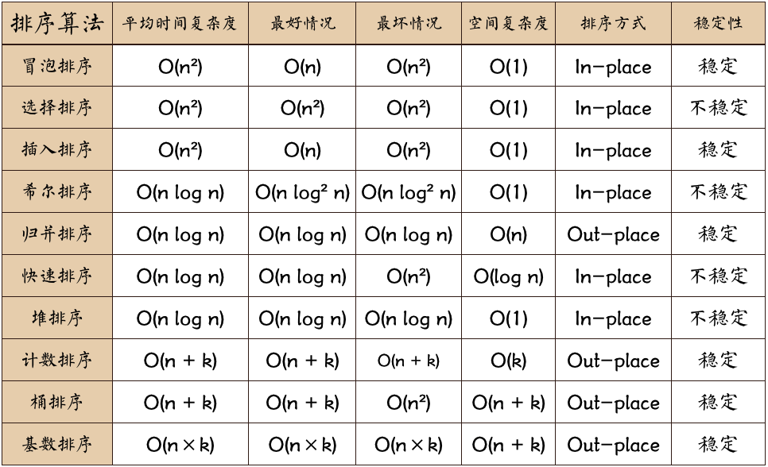

## js实现十种排序算法

十大经典算法排序总结对比
[](docs/sort_algorithm/fuzadu.png)

### 冒泡排序
冒泡排序须知：
作为最简单的排序算法之一，冒泡排序给我的感觉就像Abandon在单词书里出现的感觉一样，每次都在第一页第一位，所以最熟悉。。。冒泡排序还有一种优化算法，就是立一个flag，当在一趟序列遍历中元素没有发生交换，则证明该序列已经有序。但这种改进对于提升性能来说并没有什么太大作用。。。

什么时候最快（Best Cases）：
当输入的数据已经是正序时（都已经是正序了，我还要你冒泡排序有何用啊。。。。）

什么时候最慢（Worst Cases）：
当输入的数据是反序时（写一个for循环反序输出数据不就行了，干嘛要用你冒泡排序呢，我是闲的吗。。。）
冒泡排序动图演示： 
[](docs/sort_algorithm/maopao.gif)
冒泡排序JavaScript代码实现：
```javascript
function bubbleSort(arr) {
    var len = arr.length;
    for (var i = 0; i < len; i++) {
        for (var j = 0; j < len - 1 - i; j++) {
            if (arr[j] > arr[j+1]) {        //相邻元素两两对比
                var temp = arr[j+1];        //元素交换
                arr[j+1] = arr[j];
                arr[j] = temp;
            }
        }
    }
    return arr;
}
```